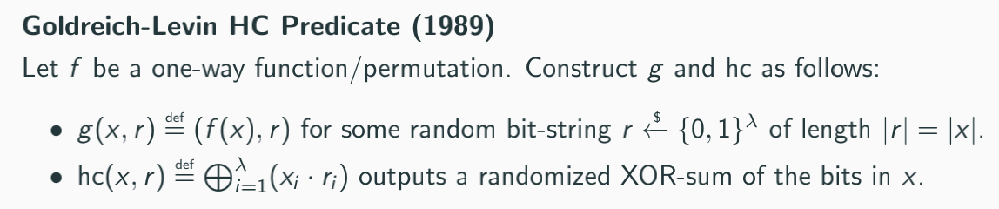
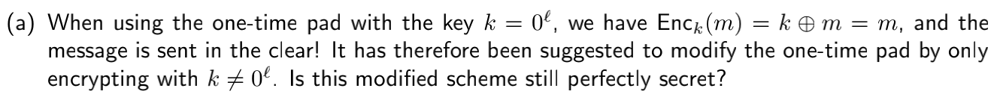
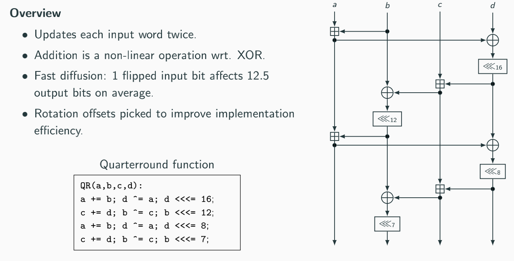
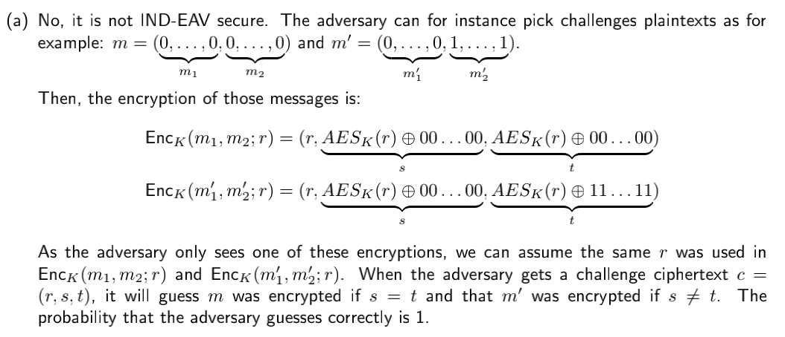
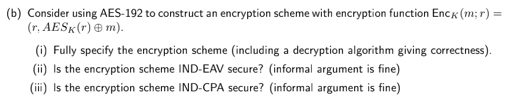
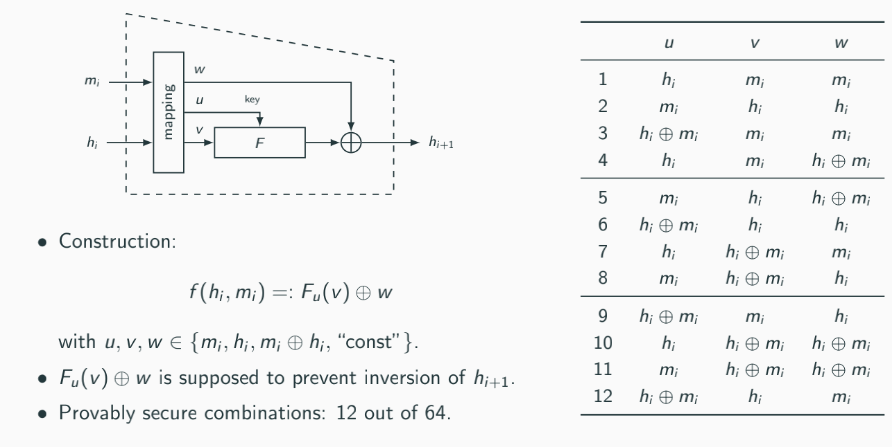
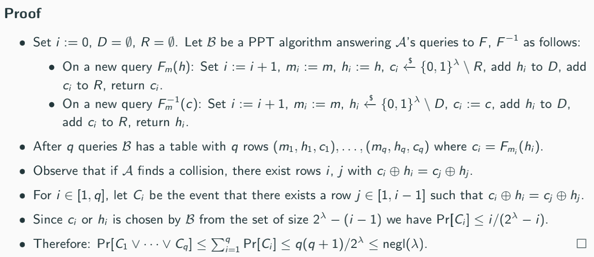
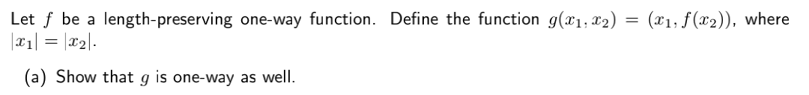
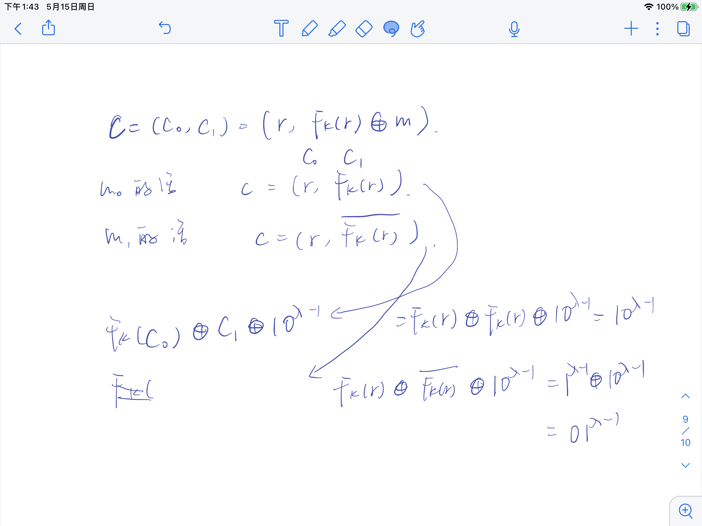
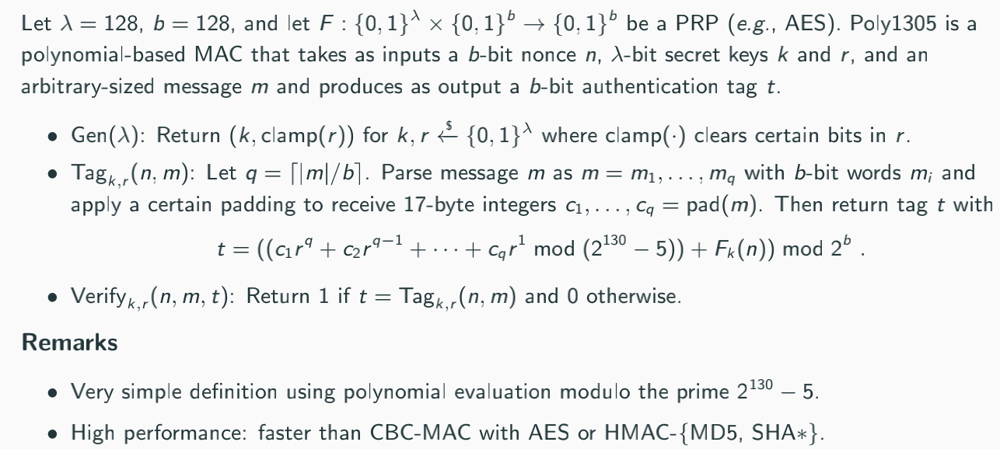

## COMP0025 Lecture Review

一些攻击模型

* **Passive Attacks**
  * **Ciphertext-Only Attacks (COA)**：攻击者只看得见ciphertexts
  * **Known-Plaintext Attacks (KPA)**：攻击者知道一些plaintexts和ciphertexts对

* **Active Attacks**
  * **Chosen-Plaintext Attacks (CPA)**：通过给Alice发送$m_j$来获取$c_j$
  * **Chosen-Ciphertext Attacks (CCA)**：通过给Bob发送$c_j$来获取$m_j$（好像也可以选择明文）任意制造或者选择一些密文，并得到其解密后的明文

[TOC]

### Lecture 1 Classical cryptography

#### 1.1 Historical Ciphers

* **Transposition ciphers（移项）**: letters are permuted according to some scheme

  * **Scytale**：木棍上缠绕（密钥是木棍粗细）

  * **Columnar Transposition**：根据密钥中字母顺序对plaintext分块进行排序

    

    **Breaking**：暴力破解，穷举每个可能长度的key的可能顺序，有$\sum_{k=1}^{l}{k!}$种可能性。[problem]:可能有多种解，如sepha->shape, heaps, phase

  * **Shift Ciphers**：Caesar cipher（字母向后位移三位），ROT13（字母位移13位）

    **Breaking**：穷举所有位移可能性（25种）

* **Substitution ciphers（替换）**: letters are substituted by other letters or symbols

  **Breaking**：穷举有$26!$种变换不能暴力破解，所以采用**字母频率**（**Letter Frequency**）统计破解，同时运用一些二元三元字母组合（**Bigram/Trigram Frequencies**）

  * **Polyalphabetic Substitution Ciphers**：多字元，eg. Vigenere

    

    **Breaking**：

    * 字元长度已知，可以分块对密文进行频率分析

    * 字元长度未知：**Kasiski’s Test**

      

  * **Playfair Cipher**

    * Same row: pick letters to the right, wrap around to the left if needed

    * Same column: pick letters to the bottom, wrap around to the top if needed

    * Span rectangle: pick letters on the opposite corners within the same row

    * Same letters or odd message length: inject/append a pre-defifined dummy letter (say x)

    

#### 1.2 The Mechanization of Encryption

* **Hebern Rotor Machine**：内部含有替换表，key用rotor初始化，像Vignere，频率分析COA破解
* **Enigma**：COA破解

### Lecture 2 Principles of modern cryptography and pseudorandomness

#### 2.1 Principles of modern cryptography

这一章主要是算法安全性理论不停地更新

**Private-Key Encryption Schemes**

：表示以相同概率从集合里随机选择一个元素

 Π：一般用于表示对称加密的模式

* **One-Time Pad**

  

  $\{0,1\}^\lambda$：长度为$\lambda$的二进制字符串

* **Probability Distributions**

  

  K是随机的，但message M分布并不是随机的，因为明文是有意义的。

  <u>加密算法的目标就是要让密文C的分布变得uniform</u>

* **Perfect Secrecy**

  

  这个可以抵抗COA

* **Perfect Indistinguishability**

  

  

**Perfect Secrecy = Perfect Indistinguishability**

*<u>证明OTP是Perfect Secrecy：</u>*

因为针对每一对m和c都只有唯一的一个k使加密算法成立（这个算法是bijective的）

**Limitations：**

* 每次加密都需要更换密钥，因为会泄漏明文（given *c*1 = *m*1 ⊕ *k* and *c*2 = *m*2 ⊕ *k*, then *c*1 ⊕ *c*2 = *m*1 ⊕ *m*2）。KPA可以破解不更换密钥k的OTP（given *m*1, *c*1, and *c*2, then *m*1 ⊕ *c*1 ⊕ *c*2 = *m*2）
* k和m一样长，加密大型文件很困难，存储k也需要很大空间

**Goals：**1⃣️re-used key2⃣️shorter key

⬇️

为什么OTP不能用shorter key？$\rightarrow$ 因为这样会使算法不是perfect secrecy：

**Perfect Secrecy的一般化——Shannon's Theorem**

⚠️注意这里有个前提条件：明文、密钥、密文的长度都相同

**Goals：可以设计一个算法有shorter密钥但没有perfect secrecy。但是，这个算法安全的前提是Advesary的算力有限制。因为这个算法可以被暴力破解。**

⬇️

**Information-theoretic vs Computational Security**

* Information-theoretic：没有信息泄漏，攻击者的算力无限，模型不实用
* Computational Security：会有信息泄漏，攻击者算力有限，模型实用

**Computational Security**

1⃣️限制Adversary的最大计算时间2⃣️设置Adversary能破解算法的概率

* Concrete Security：具体数值

  

  * Brute-Force Attack

  Con：计算机算力不好计算；Adversary的攻击算法也不好计算；微处理器的算力变化

* Asymptotic Security：用时间复杂度来描述计算时间和攻击成功概率

  背景知识

  1⃣️关于密钥长度的多项式polynomial

  * **Probabilistic Polynomial Time Algorithms**

    

    <u>Tips</u>:   (g ◦ f)(x) = g (f(x))；(f·g)(x) = f(x) · g(x)

  2⃣️关于密钥长度的极小值函数negligible

  * **Negligible Functions**

    
  
  **Negligible Success Probability**：A cryptographic scheme is *unbreakable in practice* if the probability of a successful attack by an arbitrary PPT adversary *A* is negligible.
  
  <u>Asymptotic Security定义：</u>
  
  
  
  Cons: 确定 *λ* 有点困难

**Computational Indistinguishability**

**Next** Can we build a *practical computationally secure* One-Time Pad?

#### 2.2 Pseudorandomness

**Goals** Can we build a *practical computationally secure* One-Time Pad?

**pseudorandom generator**

G把$\lambda$长度的密钥$k$变成$l(\lambda)$长度的串$G(k)$，然后用$G(k)$加密明文。对于每个$k$，生成的$G(k)$应该看起来都是随机的。

**Randomness Versus Pseudorandomness**

* True Randomness：从物理现象中生成；不能预测的；均匀分布
* Pseudorandomness：可以预测；计算上的不可分辨性（computational indistinguishablity），均匀分布

**Pseudorandom Generators (PRGs)**

两个关键：扩展 & 随机

**Brute-Force Attacks on PRGs**

PRGs输出的分布并不是均匀的，下图中， 输入长度为$\lambda$，输出长度为$2\lambda$，这种情况下产生的随机数只有$2^\lambda$种可能性，而正常的长度为$2\lambda$的随机数有$2^{2\lambda}$种可能性。

暴力破解：

【关于第二个为什么是$2^{-\lambda}$】G的输出结果只有$2^\lambda$种可能性，而正常的长度为$2\lambda$的随机数有$2^{2\lambda}$种可能性，所以D预测正确的可能性只有$2^\lambda \div 2^{2\lambda}=2^{-\lambda}$

**Goals** 如何用OWF来生成PRGs

**One-Way Functions**

已知x和f(x)，找不到一个x'使得f(x')=f(x)

单向函数 (*One*-*way* *function*)是一种具有下述特点的单射函数：对于每一个输入，函数值都容易计算（多项式时间），但是给出一个随机输入的函数值，算出原始输入却比较困难（无法在多项式时间内使用确定性图灵机计算）。

**One-Way Permutations**

injective： *f* ( *x* 1 ) = *f* ( *x* 2 )意味着*x* 1 = *x* 2

即使用了OWF仍然有可能泄漏变量：Example: Let *g* be a one-way function, then *f* (*x*1*,* *x*2) = (*x*1*,* *g*(*x*2)) is hard to invert but reveals *x*1. （g是OWF但是G泄漏了输入的一半）

**Hard-Core Predicates**

给定f(x)，对于任何多项式时间算法，不能以明显高于1/2的概率确定hc(x)，也就是猜测hc(x)能够有1/2的正确率。

**HC Predicate for Any One-Way Function**

给定任意一个OWF/OWP f，能构造一个不同的OWF/OWP g以及g的一个HCP。

这个hc计算的是x里任意几个比特的异或值（因为ri=0时就不计算xi，ri=1时就异或xi），这个定理实际含义：<u>如果f是任意OWF，那么f(x)隐藏了x的比特位的一个随机子集的异或值</u>。

**Pseudorandom Generators with Minimal Expansion** 只扩展一位

**Goals** 用上述hcp构造PSG

用OWP构造PSG（OWF也可以构造，但是太复杂了，不讨论）

为什么可以构造：s是随机选择的，f是OWP，所以f(s)也是伪随机的，hc(s)也是伪随机的（即使给定f(s)，因为s是随机的），所以总体是伪随机的。

**Pseudorandom Generators with Polynomial Expansion** 扩展多位

根据上一个迭代就能得到多位扩展

**Goals** Construction of a **computationally secure** One-Time Pad using a **Pseudorandom Generator**

**One-Time Pad with PRG**

indistinguishability against eavesdroppers

**Goals** 证明OTP with PRG的安全性

**Reduction Proofs**： 把问题转化为另一个更好解决的问题，⬇️证明流程

**Security Proof for OTP with PRG**

图中可以把D和A的模型等价，也就是把D reduction到A模型。证明是indistinguishability encryption

> 参考课本44-45的细节内容

OTP with PRG扩展到加密不定长的m：先用前面提到的expansion factor扩展G(k)，再取和m相等长度的位数加密。

**Stream Ciphers**：生成伪随机流的算法

**Security for Multiple Encryptions** ： 当窃听者A能够获取多个c时

这边构造的是一个反例：

**Goals** How can we construct practical computationally secure encryption schemes supporting “arbitrary” many encryptions per key?

****

#### 做题思路

* **Perfect secrecy/indistinguishibility**

  从<u>定义</u>上证明，有两种方法：

  1. 证明任意两个明文输出相同密文的概率是相同的（这种情况下一般是可以直接计算出两个概率的，直接对比数值）

     

     例子：

     

  2. 证明攻击者根据密文区分不了输入的是哪个明文

     

  从<u>性质</u>上证明，所有Perfect Secrecy都具有以下性质：

  

  例子：

  

  

*  **Pseudorandom Generators**

  1. 证明是PRG，一般都用反证法，其中可以用到PRG的的定义，针对G函数和随机选取的真随机，计算概率差值是否是negl：

     

     例子：

     

     

  2. 证明不是PRG的时候，可以用两种方法：构造反例&用定义证

     构造反例例子：

     

     

     用定义证例子：

     

     

  

### Lecture 3 Private-key Encryption

**Goals** How can we construct practical computationally secure encryption schemes supporting “arbitrary” many encryptions per key?

承接上一个Lecture，因为Lecture2构造了单次加密的computationally secure encryption schemes，这一个Lecture研究multi encryption的问题。

****

#### 3.1 PRG PRF PRP

**From Pseudorandom Generators (PRGs) to Pseudorandom Functions (PRFs)**

但是一个random function的描述需要指数级别的$\lambda$来描述，没有PPT算法能描述。所以构建一个oracle access，D将x发送给f，f进行查表返回f(x)。

**Pseudorandom Functions (PRFs)**

> 课本p53-p54

f是一个random chosen function，有$2^{\lambda \cdot 2^\lambda}$中可能性

F is hard to invert，有$2^\lambda$种可能性

目标就是让PPT算力的攻击者A区分不出这两种随机函数生成结果。

**Goals** use a PRG to construct a PRF

【这边其实已经有点能看出分块加密的性质了】

**Chosen-Plaintext Attack (CPA) Indistinguishability Security Game**

当Enc是随机的时候，oracle access能保证随机性。

**Indistinguisability against Chosen-Plaintext Attacks (IND-CPA)**

IND-CPA是加密模型应该满足的最基本的性质；IND-CPA包含IND-KPA；$PrivK^{eav}$是$PrivK^{cpa}$的一种特殊情况，即A没有使用oracle access。

IND-CPA security is **not** achievable if Enc is deterministic：因为如果Enc确定，那么输入m能得到固定的c，A就能比较m和m0以及m1知道b的值了。

**因此，必须要把随机性作为加密过程的一部分，来确保相同消息的加密可能是不同的。**

**Building IND-CPA Secure Symmetric Encryption Schemes: OTP with PRF**

deterministic OTP with PRG is not IND-CPA. 因为不能抵御multi的攻击。

**证明OTP with PRF是IND-CPA的**

关于上面Then后第二条的信息补充：

**OTP with PRF for Variable-Length Messages**

不可取，这种情况下密文起码是明文的两倍长了。因为每个大小为$\lambda$的分组都是用一个$\lambda$的字符串来加密的，这个字符串还必须作为密文的一部分。

**Pseudorandom Permutations (PRPs)**

#### 3.2 Modes of operations: ECB, CBC, OFB, CTR

所有block ciphers都是PRP；block cipher不是full encryption scheme因为只分块加密。

**Electronic Code Book (ECB) Mode**

ECB是deterministic的，所以不是IND-EAV也不是IND-CPA，不应该被使用。

k是固定的。

**Cipher Block Chaining (CBC) Mode**

解密可以并行操作，因为所有ci都有。

CBC is IND-CPA secure if *F* is a PRP and a new random IV is chosen for every new message.

**Output Feedback (OFB) Mode**

不能并行操作，但是每个$F_{k}^{i}(IV)$都可以提前计算好进行加密解密

OFB is IND-CPA secure if *F* is a PRF and a new random IV is chosen for every new message.

**Counter (CTR) Mode**

每个块都是并行加密和解密的；时间复杂度小。

CTR is IND-CPA secure if *F* is a PRF and a new random IV is chosen for every new message. 

#### 3.3 Block Ciphers: DES, 3DES, AES

**Common Approaches to Build Block Ciphers**

* Feistel Networks (*e.g.*, DES, 3DES)

* Substitution Permutation Networks (*e.g.*, AES)

**Feistel Networks**

无论fi怎么构造，Feistel都是可逆的。

**PRP Construction using Feistel Networks**

也就是对Ri进行计算的函数fi变成PRF（不需要PRP的原因是：无论fi怎么构造，Feistel都是可逆的。）

**Data Encryption Standard (DES)**

 **Substitution Boxes**

映射6bit(b0,...,b5)到8bit，行用b0和b5表示，其余四位表示列，这样能在映射表里对应出8个bit。

<u>优点**Avalanche Effffect**（雪崩效应）：6bit中只要改变一个bit就会导致结果起码有2个bit的改变，再结合后续的E和P就能在改变1bit的基础上造成起码一半的输出bit被改变。</u>

**DES Key Schedule**

56bit的key，8bit忽略，其余48bit重排列生成ki

DES的安全性并不是很好，所以进行了以下尝试：

**Increasing the Key Length of a Block Cipher**

Double Encryption：不可取，可以被 **Meet-in-the-Middle Attack**破解

攻击者分别计算这两个值，然后对比，时间复杂度和一次加密一样。

**Triple Encryption**

暴力破解需要$O(2^{3\lambda})$，Meet-in-the-Middle Attack仍然可以奏效但是复杂度是$O(2^{2\lambda})$

**Confusion-Diffffusion Paradigm**

混淆：每个密文位都应该依赖于多个密钥位。为了隐藏密钥和密文之间的关系。

扩散：在明文中翻转一bit大约是翻转密文中一半的bit。目的是隐藏明文和密文之间的关系。

要满足雪崩效应。

**Substitution-Permutation (SPN) Networks**

满足了Confusion-Diffffusion

**Advanced Encryption Standard (AES)**

SubBytes：用一个S盒完成分组的字节到字节的代替。满足confusion

ShiftRows：Cyclic left shift *i*th row by *i* positions for 0 *≤* *i* *≤* 3.和MixColumns一起提供confusion。

MixColumns：利用域GF(28)上的算术特性的一个代替。

AddRoundKey：当前分组和扩展密钥的一部分进行按位异或XOR。

**AES Key Schedule**：AES的轮数取决于密钥长度。

**Security of AES**：是安全的并仍在使用。Most widely used: AES-128. Recommended: AES-256

#### 3.4 Stream Ciphers: RC4, ChaCha20

每次加密都通过密钥生成一个密钥流，解密也是使用同一个密钥流，明文与同样长度的密钥流进行异或运算得到密文。

**RC4**

Key-scheduling algorithm (KSA): initalize state

Pseudorandom generation algorithm (PRGA): produce keystream

RC4生成key stream并不是完全随机的，不安全，现在不用了。

**ChaCha20**

替代了RC4

**ChaCha20: Quarterround**

**ChaCha20: Doubleround**

****

#### 解题思路

* **Pseudorandom Functions (PRFs)**

  **证明是PRF**

  1. 用反证法。如果不是PRF那么原来构造它的PRF也不是PRF了。

     

     

  2. 就根据定义硬证（这个证明方法略显迷惑

     

     

  **证明不是PRF**

  构造反例和D have access to oracle，给一对输入，让函数输出的概率不是negl，同时说明真正的PRF给定这个输入的输出是negl。<u>反例最好根据给定函数的计算特性来构造。</u>

  例子1:

  

  这题用到了||所以构造x和y的时候可以考虑到||的特性

  

  

  例子2:

  

  这题有异或，构造的时候可以用异或的特性消除掉输入值

  

* **Indistinguisability against Chosen-Plaintext Attacks (IND-CPA)**

  证明是IND-CPA的：OTP with PRF的例子，就是用定义证【目前没看见反正法】

  证明不是IND-CPA的：A能根据输出结果判断输入是哪一个

  例子1：

  

  

  例子2：

  

  

* **IND-EAV**

  证明是IND-EAV的：直接根据随机数生成性质证明（eg. PRP输出是随机的）

  证明不是IND-EAV的：

  例子：

  

  

* IND-EAV和IND-CPA的证明区别

  

  

### Lecture 4 Hash Functions

#### 4.1 Hash Functions

**Hash Functions**：OWF将任意大小输入m压缩成一个短的、固定长度的输出h。

**Collision Resistant Hash Functions (CRHF)**

和PRF的区别：key s不需要是随机的。

重点：攻击者A无法在PPT时间范围内找到$x\neq y$满足$H(x)=H(y)$

**Weaker collision resistance**

三个CR类型：

* CR：攻击者A无法在PPT时间范围内找到$x\neq y$满足$H(x)=H(y)$

* PR1：给定h，无法找到x满足H(x)=h

* PR2：给定h=H(x)，无法找到y满足H(y)=h

是CR就一定是PR2；是PR2，就是PR1

集合范围：CR < PR2 < PR1

**CRHF的应用**

* 密码和软件合法性校验
* 比较两个文件内容一致性

**Finding Collisions**

可以找到collision，即使输入相同长度的情况下找不到collision，也能在不同长度的输入中找到collision。这种方法是暴力破解，算法复杂度太高了。

因此考虑到了**Birthday Attacks**

****

下面都是证明birthday attack为什么能缩小寻找collision的时间复杂度

**Upper Bound for Collision Probability**

用birthday attack的原理：总人数是q，生日的可能性有N个，也就是计算在q中任意取两个人的生日相同的概率。

**Lower Bound for Collision Probability**

影响重点：时间复杂度减小了；**但是这个攻击只对CR有效，对PR1和PR2无效**。

****

#### 4.2 Modes

**Random Oracle Model (ROM)**

**Random Oracle**：输入m，输出一个l bit的随机字符串s。是infinite object，不能通过PPT算法公开计算。要获得R(m)，必须输入m查询输出R(m)。输出是不可预测的，而且是均匀分布的。

**Hash Functions as Random Oracles**：Distributions of *R*(·) and *H*(·) are *computationally indistinguishable*.

注意一下图上的broken-secure分界线。

**Merkle-Damg˚ard Transformation（MD创建hash函数）**

把n bit串分成b个长度为l的块，最后一块长度不够就补齐。

**Security of MD Transformation**

If *f* is a fixed-length collision-resistant compression function, then *H* built by MD transform is a CRHF.

反证法：假设H不是CRHF，证明这种情况下能找到f的collision例子。

**Length Extension Attacks on the MD Transformation**

长度扩展攻击允许任何人在末尾包含额外信息消息并在不知道秘密的情况下产生有效的散列。虽然攻击者不知道原始m，但是只要知道原始m的长度，就可以通过尝试使用各种假定长度的伪造m来确定，并检查哪个长度能够使H(m)相同。

抵御这种攻击：添加一些后处理步骤，例如，一些混合或最终压缩。

MD4/5, SHA0/1/2 都容易收到这种攻击。SHA3 and BLAKE∗可以抵御这种攻击。

**Build Hash Functions from Block Ciphers**

第一种：**Compression Function from Block Ciphers (First Attempt)**

‼️证明不是CR：直接构建$m\neq m'$使得$H(m)=H(m')$

而且上述函数计算是可逆的。

第二种：**Compression Function from Block Ciphers (Better Approach)**

这里函数计算就不可逆了，有12种组合都是安全的。

**Davies-Meyer Compression Function**

**Compression Functions: Collision Resistance**

**证明DM Compression Functions 是 Collision Resistance**

> TODO【没太看懂这个证明，先放一会】

**Hash Functions from Practical Block Ciphers**

SHA-1不安全，但是git还在用

**SHA-3** 是 Keccak proposal

**Keccak’s Sponge Construction**

和哈希函数不同：输出是任意值

r：用于吸收和提取bit string

c：安全参数

通过使用b=r+c的b-bit排列f来转换状态

**Keccak’s Permutation**

**Security of Keccak**： 能抵抗length extention attack，因为c不会被输出

**Hash Iterative Framework (HAIFA)**

用来解决MD transforamtion能够被length extention attack攻击的缺点，也就是不把输出结果给出，增加salt无法获取输出。

**BLAKE Hash Function Family**：Based on HAIFA mode and ChaCha-like compression function

#### 解题思路

* 证明collision resistant

  是collision resistant：反证法

  例子：

  

  

  

  不是collision resistant：构造反例，注意**hash function输出的长度是固定的**

  例子1：

  

  

  例子2:

  

* 证明PR1

* 证明PR2

下面这俩感觉应该放到Lecture2的作业里

* 证明OWF：是OWF用反证法，反向计算的pr大于negl

  

  

* 证明hard-core predict：是HCP用反证法

  

### Lecture 5 Message Authentication Codes

**Goals**：前文的攻击者只能观察密文，选择明文。这一节的攻击者可以直接交互修改密文的内容，因此需要的传输的消息内容进行验证。

加密算法不能保证信息的完整性：

* **One-Time Pad with PRF**

  

*  **CBC Mode**

  

*  **OFB Mode**

  跟上面差不多原理

* **CTR Mode**

  跟上面差不多原理

**Message Authentication Codes**

**Chosen-Message Attacks**：攻击者构造一个message pair(m,t)使得Verify(k,m,t)=1，且m是一个新的message。

**existential unforgeability under chosen-message attacks(EUF-CMA)**

A可以访问Tag和Verify oracle；Q是A能从oracle获取的所有message-tag对。

Tag的必须要有足够的长度，否则就可以被A暴力破解。

#### 5.1 MACs - constructed from PRFs and block ciphers

**MAC with PRF**

这个是一个固定长度的MAC。

定理：‼️**如果$F_k$是PRF，那么这个MAC with PRF就是EUF-CMA secure的。**

Proof：反证法。假设MAC不安全，那么$F_k$就不是PRF。

但是下面这个证明是构造相似模型，用定义证明的。

**Use fixed-length MAC with PRF to process arbitrary long messages**

不可取。PPT给了三种构造方案都是不行的。因为消息块必须被链接，以防止其替换或重新排序，并且必须考虑消息长度，以防止消息块删除攻击。

**Secure Variable-Length MAC**

如果tag同样长度的消息m用相同的r，攻击者可以构造(m,t)对替换掉原始的。

如果tag同样长度的消息m用不同的r，攻击难度和攻击fixed-length MAC一样。

这个扩展并不efficient，因为要分组加密4l次，MAC标记长度也很长 *|**m**|* = *l* *·* *λ* bits implies *|**t**|* = (4*l* + 1*/*4) *·* *λ* bits.。

**Goals：** 构造更有效的Variable-Length MAC

**CBC-MAC**

当n是固定的情况下，这个模型才是EUF-CMA secure的，否则攻击者可以往后面继续加新的block。

**Efficiency** 最佳 tag length *|**t**|* = *λ* and requires only one call to *$F_k$* per *$m_i$*.

**Secure CBC-MAC Extensions**

* 对每个可能的消息长度使用不同的key
* 预先考虑m的总长度l并在第一个block中处理
* 设置两个k，只有最后一个块用另一个key加密，这样l就不需要预先知道了

#### 5.2 MACs - constructed from hash functions

**MACs and Hash Functions**

MD创建的hash函数末尾一般都会继续补上一个长度n的块，这样可以防止攻击者在后面继续创建块。这种情况下创建的MAC就不会被攻击者用extention length attack攻击了。

**Nested MAC (NMAC)**

**Security of NMAC**

定理：‼️If *f* is collision-resistant and acts like a EUF-CMA-secure fixed-length MAC, then NMAC is EUF-CMA secure.

证明：反证法。假设NMAC不安全，那么要么f不是CR，要么f不是固定长度的MAC

Case1: CR的特性

Case2: fixed-length MAC特性，也就是攻击者不能伪造出。

**Hash-based Message Authentication Code (HMAC)**

因为NMAC的IV需要修改，在实际应用中会比较复杂。HMAC让compression function和hash function使用不同的密钥。而且这两个密钥归根结底是同一个密钥k。

【对比这个图和NMAC的图】

HMAC是NMAC的一个特例。

HMAC的应用：HMAC-SHA1

#### 5.3 Ciphertext integrity

IND-CPA确保的是加密而不是message integrity，所以需要改进。

**Chosen-Ciphertext Attacks (CCA)**：在实践中，A可以发送一些密文ci给Bob，Bob解密给mi，然后发送给Alice。这种情况可能会发生很多次。即使A在攻击期间的任何时候获得其选择的任何密文ci的明文mi，加密消息mb的不可区分性也应该成立。

**IND-CCA Security for Private-Key Encryption**

‼️**Theorem** Any IND-CCA secure encryption scheme is also IND-CPA secure.

攻击者能够攻击IND-CPA那么也能攻击IND-CCA。

证明：构造相似模型，用定义证明。

**Theorem** 是IND-CPA security 不一定是IND-CCA security.

攻击者能够攻击IND-CCA不一定能攻击IND-CPA。

证明：构造反例。

**Authenticated Encryption: Encrypt-then-MAC**

⚠️只有这个是安全的， Encrypt-and-MAC and MAC-then-Encrypt都是不安全的

**Theorem** If SE is IND-CPA secure and MAC is EUF-CMA secure, then the authenticated encryption scheme AE is IND-CCA secure.

证明：假设AE是不安全的，那么SE或MAC是不安全的。

* 假设AE是不安全的，证明MAC是不安全的。

  

* 假设AE是不安全的，证明SE是不安全的。

  

**Polynomial-based MAC: GHASH**

**Authenticated Ciphers: AES-GCM** 基于GHASH的

Galois Counter Mode (GCM)：authenticated encryption mode based on the Encrypt-then-MAC paradigm.

**Polynomial-based MAC: Poly1305**

**Authenticated Ciphers: ChaCha20-Poly1305** 基于poly1305

**Replay Attacks**

记录下A原先发送给B的(m,t)数据对，一段时间后重新发送给B。

EUF-CMA security game不受replay attack影响，因为要求m是不同的。但是MAC本身容易收到replay attack攻击。如果与其他机制相结合，mac可以抵御replay attack。

**Using MACs to Protect Against Replay Attacks**

两个机制：

* **Session Identififiers**：双方同意使用一个唯一的会话标识符sid；计算标签*t* := Tag*k* (sid ||i||mi)，i是一个计数器，确保freshness。协议有时使用不同的计数器序列来区分双方的消息，例如，AB使用奇偶数。
* **Timestamps**：*t* := Tag*k* (*s*||mi)，s是时间戳；只有当标记有效且所包含的时间戳在某个时间范围内时，双方才会接受消息。

**MAC-based Authentication in Multi-User Settings**

多人互相通信的情况。大家使用同一个key k时，不能区分消息是谁发的。

解决方案：每两个人i和j通信，使用单独的keyij；用keyij计算tag。

这种解决方案具有缺陷，因为人数很多的情况下，每个人需要存储n-1个key。

#### 解题思路

* 判断MAC是否secure

  insecure：构造反例。

  * 获取几个tag对，能够生成不包含这些tag对里的有效对 a.1, a.3
  * 构造两个输入，生成的tag对是相同的 a.2
  * 任意输入，输出都是相同的 a.4

  例子：

  

  补充encryt和MAC的顺序：

  

  在TUTORIAL里有这三种加密认证方式的具体分析。再次强调只有第三种是安全的。⚠️在接收到消息时，最好先认证再执行其他操作，否则会忽略认证这一步骤。

* IND-CCA & authentication

  

  

****

上面这些全都是对称密码学的内容，后续的内容是非对称加密的也就是公私钥。

****

### Lecture 6 Number Theory, Group Theory, and Computationally Hard Problems

**Goals：** Can we build one-way functions from computationally hard problems?

这一节课确定如何找到OWF

#### 6.1 Number theory

Number Sets

**Primes and Composites** 质数和合数

任何数都可以用质数相乘的形式表示

**Divisibility** 整除

**Division with Remainder and the Modulo Operator** 余数和模

**Greatest Common Divisor**（GCD，最大公因数） d = gcd(a, b)

**Computing GCD: The Extended Euclidean Algorithm** 扩展欧几里得算法

‼️x-yq：q是当前行的，x，y是下一行的

**Congruence Relationship for Modulo Operator** 同余

同余的一些性质：

 **modular multiplicative inverses** 乘法模逆元

**Theorem** An integer *a* is invertible modulo *n* if and only if gcd(a,n) = 1.

**Computing Modular Inverses**

**Modular Exponentiation: Square-and-Multiply**

计算$a^b \ mod \ n$

**Euler’s Phi Function** 这个在RSA算法里被用到

先把n变成质数相乘，然后再计算。

⚠️remark里的第三条性质非常重要，是RSA原理的重要依据

**Euler’s Theorem and Fermat’s Little Theorem**

#### 6.2 Group Theory

**Binary Operators** 相当于一种定义关系，比如加法，乘法，多边形等等

**Groups**

**Group** $Z_n$

**Group** $Z^*_n$

**Order of a Group Element**

**Exponentiation with Group Order**

**Cyclic Groups and Generators**

cyclic 和 non-cyclic group的例子：

可以根据generator计算出整个group的值

**Groups of Prime Order are Cyclic**

**Finding Generators of Cyclic Groups**

generator的计算结果不能有neutral element（注意Zn的ne=0，Zn*的ne=1）

所以上面的例子a=6时，i=2的情况下计算出1了，所以6不是generator

**Number of Generators in Cyclic Groups**

**Subgroups**

subgroup的一些性质：

#### 6.3 Computationally Hard Problems

**Integer Factorization Problem**（IFP）：整数因式分解。小的数字很好分解，但是大的数字就困难了。

现存的算法都需要指数时间复杂度

**Discrete Logarithms and the Discrete Logarithm Problem**

和前一个算法一样，需要指数复杂度。

#### 解题思路

* 各种计算mod的值

  * 直接计算

  * 拆分成a+b解

  * 找到规律$a^i=1 \ mod \ n $或者$a^i=a \ mod \ n $

  * 用群论order的性质

    

    例子：

    

* 乘法逆元的计算【需要注意的是计算y的时候‼️x-yq：q是当前行的，x，y是下一行的】

* 计算order

  

* subgroup

  Lagrange's Theorem: 先计算group order的公因数，这些都可能是subgroup的order。

  

  例子：

  

  

* 中国剩余定理

  
