## COMP0054 Lecture Review

[TOC]

## Lecture 1 Principles

Design security system $\rightarrow$ Define security system (Meet security policy) $\rightarrow$ Define security policy (Create threat model)

### 1.1 Introduction and Ethics

Code of conduct 

### 1.2 What is Security?

Safety vs. Security

* Safety：抵抗accident，抵御nature，可根据历史数据建模
* Security：抵抗intentional攻击，抵抗intelligent beings，要对攻击者的策略进行建模

Implications of Digital Information：复制容易；传播快；存储方便；来源难查

**CIA Triangle**

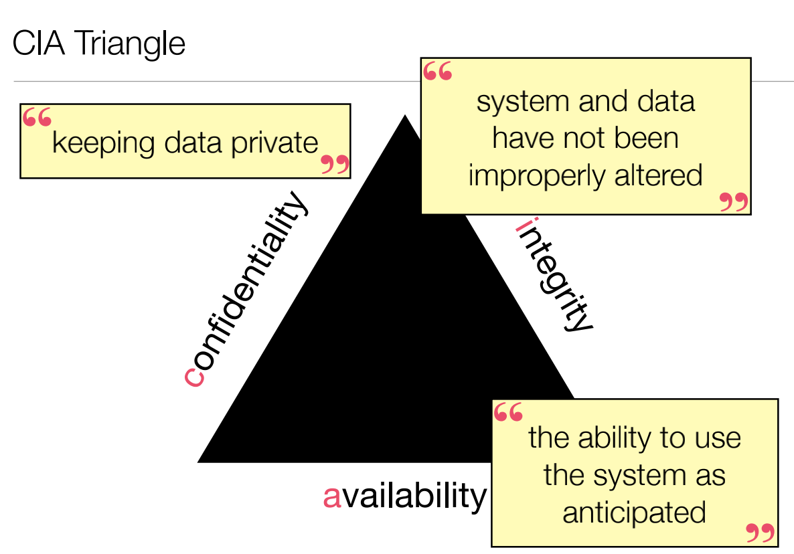

eg. Mass surveillance监控(C&I);spam(I&A);data breach(C因为没有修改data)

**Binary Model & Risk Management Model**

* Binary Model：secure & insecure（这个边界很难找）
* Risk Management Model：没有完全的安全和不安全

The Security Mindset：ant的例子（可以给任何人邮寄ants）

### 1.3 Threat Modelling

* Threats （攻击者是谁）$\rightarrow$ Attacker-centric

* Vulnerabilities （系统的漏洞在哪）$\rightarrow$ System-centric

* Likelihood attack（发生的可能性）

* Impact （attack发生后的影响）$\rightarrow$ Asset-centric

* Protection （保护措施的cost）

A system is “secure” if an adversary constrained by a **specific threat model** cannot violate the **security policy**.

**Security mechanism**: Technical mechanism used to ensure that the security policy is not violated by an adversary operating within the threat model.

### 1.4 Threat Modelling: Some Examples

* threats（capabilities&motivation）人和动机
* vulnerabilities（capabilities&vulnerabilities）
* likelihood（motivation&capabilities&vulnerabilities分析发生可能性）
* impact（motivation&scale）
* protection（vulnerabilities&cost）

### 1.5 Design Principles [SS’73]

* Least privilege 分析用户需要多少权限 eg.linux文件权限分配

* Separation of responsibilities 分层设计，不同人员管理不同内容

* Complete mediation 多次检查权限的更新，保持功能性

* Fail-safe default eg.accessing outside internet白名单而不是黑名单

* Defence in depth 安全保护的程度

* Open design eg.让密钥保密而不是加密算法保密

* Psychological acceptability 设计尽量实用

* Economy of mechanisms 简单

**Trusted computing base (TCB)** refers to every component of the system upon which the security policy relies (could be hardware, software, etc.) if something goes wrong then the security policy may be violated

Security + security ≠ security（eg.每解决一个bug可能产生更多新的bug，安全策略的融合可能并不安全）

### 1.6 Design Principles: Computer Architecture

Code is data：代码和数据一起存储，计算性能提升但是容易被恶意利用（eg.bof）

**Abstraction:** specifying meaning and behaviour of software while hiding implementation details 

**Modular code** exploits abstraction and enables composition and reuse

**Layers**

* Pros：更好的并存；可以忽略被其他层解决的问题

* Cons：上层难以解决底层问题；漏洞可能传播；单层缺陷会影响上层

**Moore’s Law**：circuit density增加；computer performance roughly doubles every 18-24 months

**Halting Problem**：anything sufficiently interesting cannot be determined about a program $\rightarrow$ Security can never be solved!

## Lecture 2 Access Control

### 2.1 Access Control: Introduction

Access Control：security mechanism that ensures all accesses and actions on system objects by principals are within the security policy.

三个对象：people，resources，functions

三块内容：authentication，authorization，audit

**Mandatory vs. Discretionary Access Control**

* Mandatory Access Control

  安全政策规定权限，用于需要中心化管理的组织

* Discretionary Access Control

  All objects have owners，owners自己决定权限赋予，<u>Note: there is still a security policy! DAC is a mechanism</u>

**Access Control Matrix**

三个元素：

* O: Objects

* S: subset of objects called subjects

* R: set of access rights

Reference Monitor：系统中强制执行访问控制决策的部分

### 2.2 Bell-LaPadula vs. Biba Models

Each document has a level. Each person has a clearance.

文件的四个安全级别：Top Secret > Secret > Confidential > Unclassified

**Bell LaPadula Model**

Rules: Read Down, Write Up

Dominance relationship: A level (c1, l1) “dominates” (c2, l2) iff c1 ≥ c2 and l2 is a subset of l1

Clearance：“Clearance” of a subject is the maximum level it has been assigned.

Principles of Integrity Mechanisms

* Separation of duties：执行决策时需要多方的认可。（交易记录的双方和这些记录都必须匹配；发射导弹所需的两名官员。）
* Rotation of duties：只允许委托人在任何特定角色上有有限的时间，限制在此角色中的其他行动
* Secure logging：日志一致性

**Biba Model**

Rules: No Read Down, No Write Up

****

<u>Bell LaPadua ensures confidentiality</u>

<u>Biba ensures integrity</u>

Sanitization problem：Process of taking objects with “low” integrity and “lifting them” to “high integrity”，如Web服务器（高）接受来自用户（低）的输入，然后将其传递给SQL解释器

解决方案：“基于permission而不是exclusion的基本访问决策”；在将其完整性提升到“高”之前，积极验证“低”对象是否在一个有效的集合内。

### 2.3 Graham-Denning Model

Each object has an “owner”

Each subject has a “controller”

A right may be transferable (with *) or not.

owner可以进行授权

### 2.4 Access Control: Implementation Issues

<u>How to “store” the Access Control Matrix?</u>

以人为单位存储 / 以资源为单位存储

<u>How to keep rules fine grained?</u>

mac：针对各个软件都有权限控制

**The Confused Deputy Problem**

Alice (OS user) asks Bob (OS server) to read a file (exam.pdf) and give her the content nicely formatted. 在具有环境权威的系统中，很难表示一个行动正在“代表”他人发生

解决方案：在Bob的流程中重新实现访问控制 / 允许Bob检查对Alice的授权

### 2.5 Role-Based and Decentralised Access Control

**Role-Based Access Control**

can implement MAC or DAC large hierarchical organisations

存在问题：

* Role Explosion：难以建立fine grained roles
* limited expressiveness：problem with implementing least privilege
* Separation of duty policies：
* example policy: any two doctors can authorise a procedure. but, how to ensure that they are distinct!

**Distributed Access Control**

不同的实体可以执行授权；不同的实体可以控制策略；分散访问决策；没有中央管理

Certificates and Electronic Signatures：

* 生成密钥对：生成一个签名密钥和一个验证密钥
* 签名：使用一个签名密钥，Alice可以“签名”一个消息M来生成S
* 验证：使用验证密钥和S，任何人都可以验证Alice签名M
* 安全属性：在不知道签名密钥的情况下，不能产生通过“验证”的签名。

K A -> B means: “K says A if B”

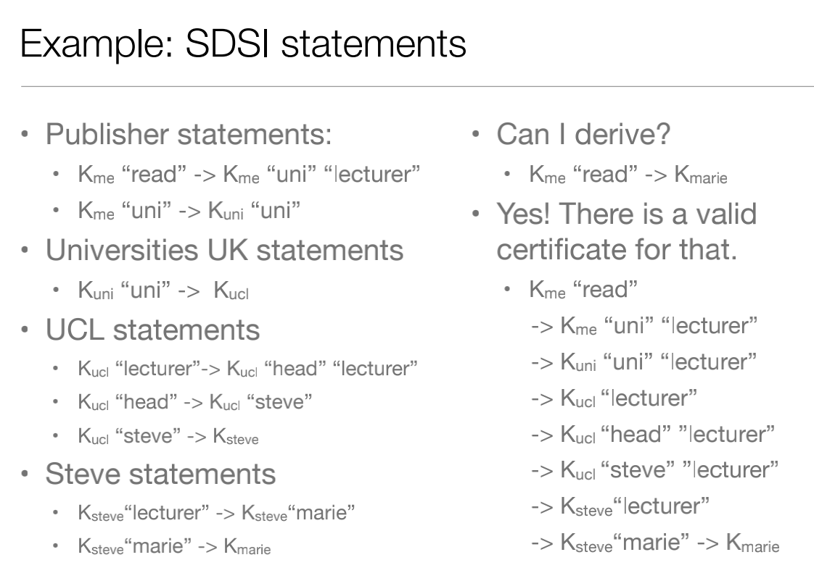

**Audit Logs**：Keep records of every operation taken and decision made against security policy.

### 2.6 Design Principles: Access Control

* Least privilege 每个人分配够使用的最小权限

* Separation of responsibilities 🈚️

* Complete mediation 多次检查reference monitor

* Fail-safe default eg.accessing outside internet白名单而不是黑名单 root权限

* Defence in depth 🈚️

* Open design eg.让密钥保密而不是加密算法保密

* Psychological acceptability 设计尽量实用

* Economy of mechanisms 简单

## Lecture 3 Auth/Passwords/Biometrics

### 3.1 Authentication

Authentication vs. Access Control

* Authentication：确保用户是具有某一类权限的用户群体

* Access Control：确保用户权限符合security policy

Authentication三个方面：What you know；What you have；What you are

----------------------------------------What you know----------------------------------------

**Passwords**

hard to leak/steal? ➡️  Hash Function

Hash Function：把输入变成固定长度；One-way function（Given x, calculating f(x) is easy. Given f(x), finding x is hard.）

好的hash function：

* flip one bit on input and half bits flip on output

* “No” collisions

存储密码时使用hash function，服务端就无法知道具体的密码

### 3.2 Breaking Passwords

linux /etc/shadow存储每个用户密码的hash值

**Offline vs Online Attacks**

Online:

* eg website login

Offline:

* eg stealing /etc/shadow

Password Cracking：彩虹表（存储常用密码的哈希值，字典攻击），**哈希值一样的密码一样**

解决方案：在密码里加salt -> uname,s,H(pword||s)，可以让字典攻击失败

<u>how to retrieve hashed and salted password?</u>

easy to enter?retrievable? ➡️  Graphical Passwords

easy to memorise? ➡️  安全问题

存在矛盾：密码安全性 vs 密码可用性

### 3.3 Challenge/Response

----------------------------------------What you have----------------------------------------

**challenge-response**

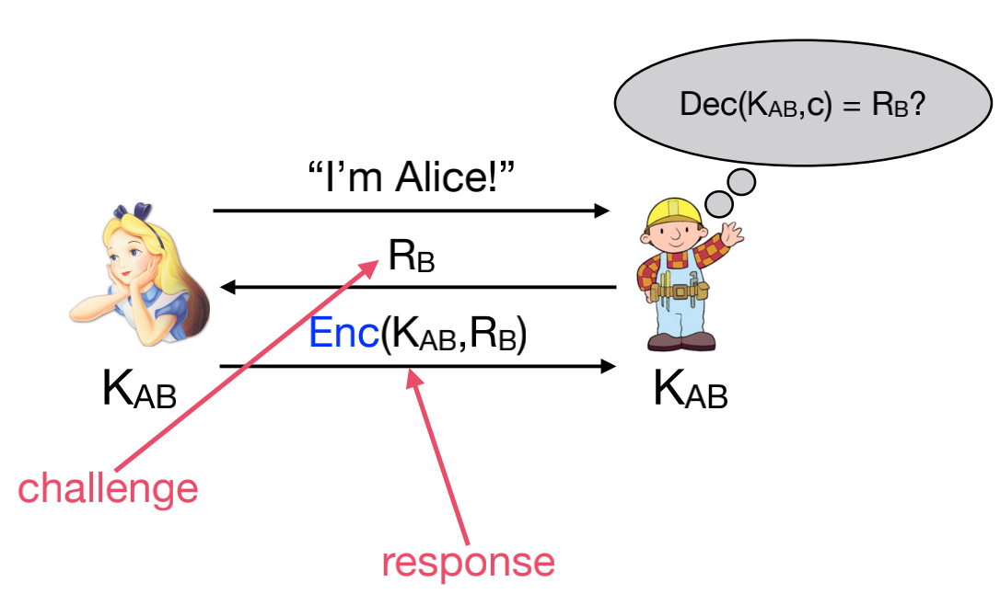

下图是错误的，因为攻击者可以伪造MAC

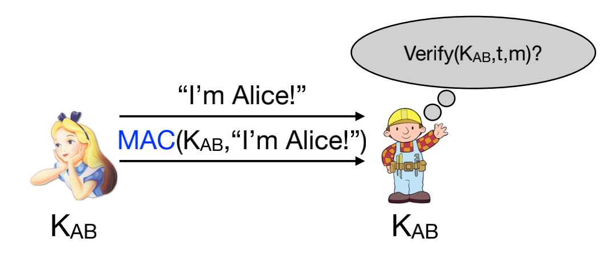

**Two-way challenge-response**

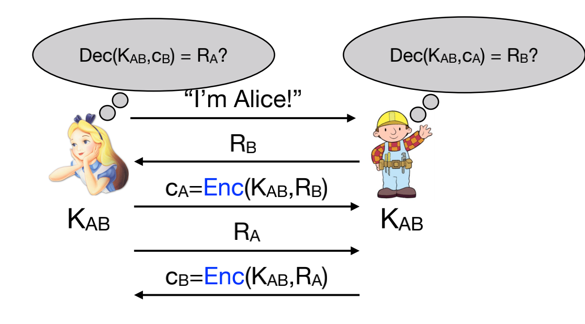

下图是错误的：

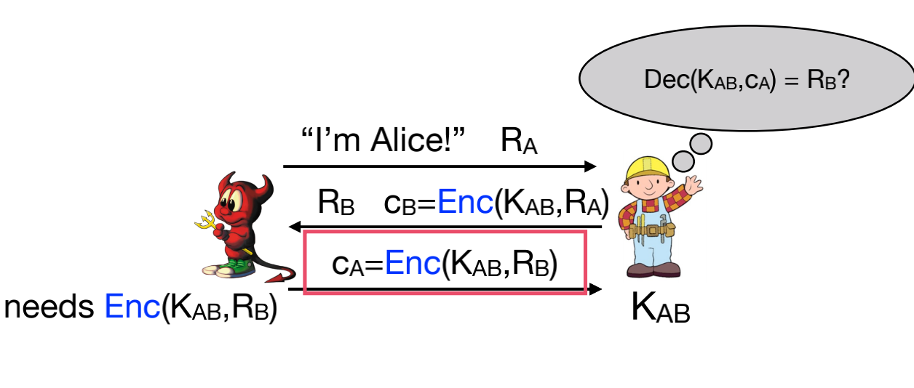

错误原因：攻击者可以构建信息发送给B以获得需要发送的Enc内容

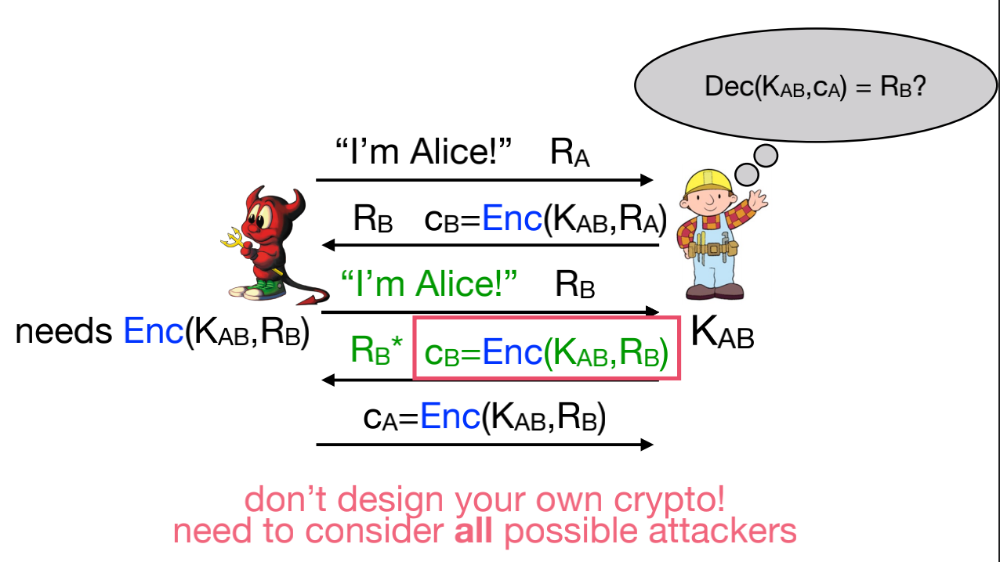

**One-Time Passwords**

根据专门算法、每隔60秒生成一个不可预测的随机数字组合

**pre-image resistance**: given h, hard to find m such that H(m) = h

----------------------------------------What you are----------------------------------------

Biometrics：Fingerprint Scanners；Hand Scanners；Retina Scanners

四个考虑维度：

* usable?

* maintainable?
* how close is the match?
* feature stability?

CAPTCHA：图形验证码

****

上述三个维度（What you know；What you have；What you are）组合使用安全性更高

## Lecture 4 Physical/No Tech Hacking

### 4.1 Security Psychology

### 4.2-4.3 Deterrence & Physical barriers

Entry control cycle：

* Deter：威慑

  三个维度的措施：监控程度、目标强化措施、环境管理措施

  eg. 军备力量威慑

  SS：**Fail-safe default** & **Defence in depth** 

* Detect 

  Access Control

* Alarm 

* Delay 

* Respond

### 4.4 Social Engineering

社工，钓鱼

## Lecture 5 Hardware

### 5.1 Physical Security and Counterfeits

CIA中的**Integrity**

Tamper-proof Software：Post hashes of files to download；Repeatedly check own file hashes；Certificates（很多盗版软件会做假证书）!

### 5.2 Hardware Security Intro

错误解决方案：

*  Check that the program is not doing something bad： Fundamental Principle of Sanitization，高级别接受低级别的用户输入。
* Check that the program is doing only something good：莱斯定理，是NP完全问题，没有解决方案。

可用解决方案：

* Emulation：仿真所有程序，确定其没有修改ref monitor
* Virtualization：动态检查不安全的程序部分
* Typing：确保程序只对“允许的”内存区域进行写入

### 5.3 Memory Protection and Security

**MULTICS operating system (1970s).** 

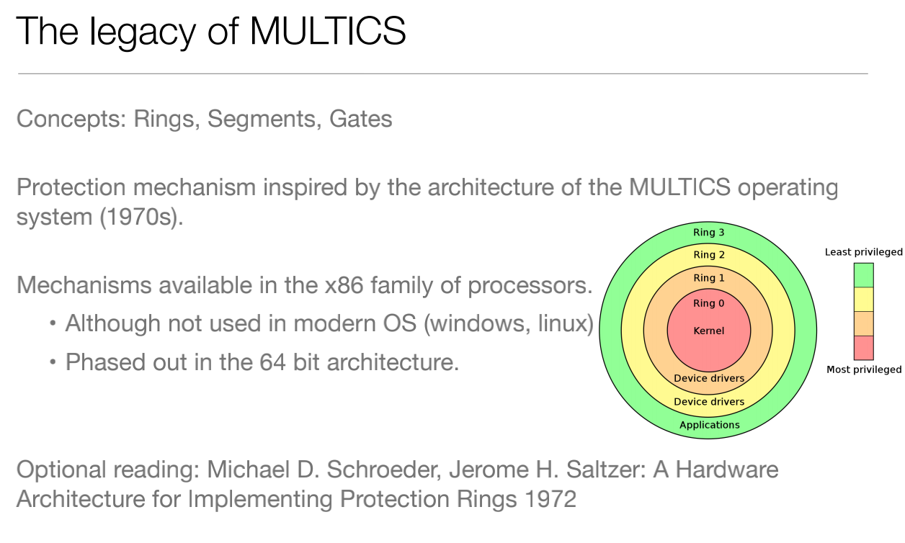

**Virtual Memory**

（操作系统里的）虚拟线性地址映射TLB

Memory Pages and Security：页表

Access Control to Memory Pages：supervisor和user

### 5.4 Hardware Security Attacks and Countermeasures

讨论虚拟地址映射的问题

Direct Memory Access (DMA)：确保用户不能直接访问物理地址。DMA 传输将数据从一个地址空间复制到另外一个地址空间。典型的例子就是移动一个外部内存的区块到芯片内部更快的内存区。

System Management Mode (SMM)：在SMM下，当保存当前正在运行程序的整个上下文（Context）时，处理器切换到一个分离的地址空间。然后SMM指定的代码或许被透明的执行。当从SMM返回时，处理器将回到被系统管理中断之前的状态。

**Rowhammer attack**

bit翻转，因为写入时的电流会影响附近位置的内容

Trusted path

* **Trusted path in** How do you know you are talking to your OS and not to a program? password
* **Trusted path out** The system is about to show you something secret. How does it know another program is not intercepting it? Windows Vista

### 5.5 Hardware Security Modules

攻击方式

* Steal the keys while they’re in plaintext

* Side channel attacks

* Supply chain attacks

Hacking HSMs: Cut the Casing；Cold Boot（关机后内存上数据会保留一段时间容易泄漏）；Evil Maid（物理层面）

## Lecture 6 Operating Systems

### 6.1 TLS

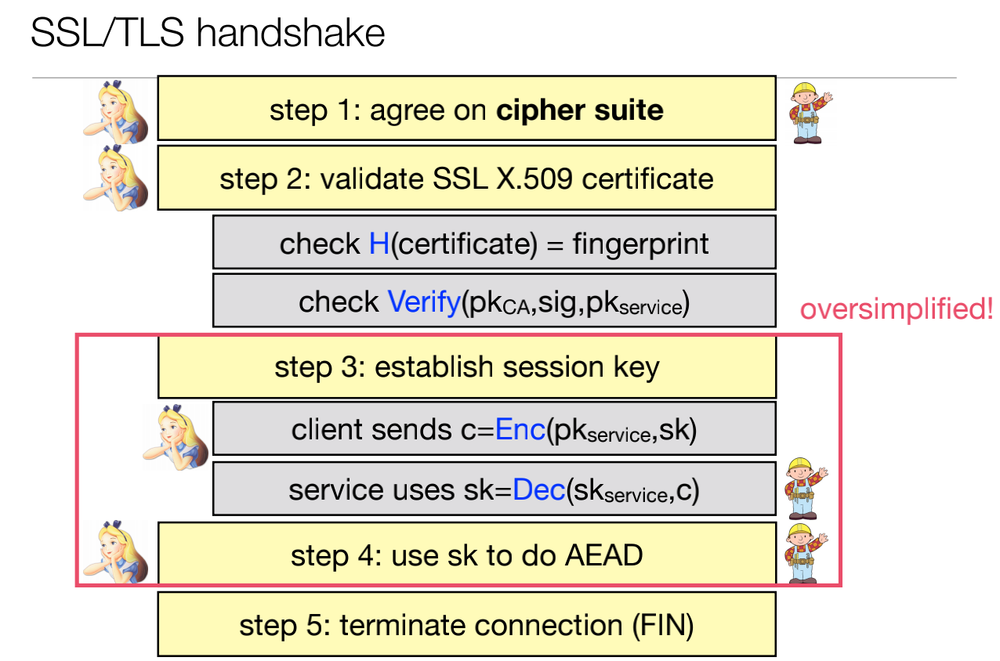

SSL是TLS的前身，**HTTPS** (Secure HTTP) means you are running HTTP over TLS

TLS Downgrade Attacks：Old browsers/servers don’t support new cryptography.

### 6.2 Randomness

Pseudorandom vs. random

在密码学中，randomness用于key generation

**P**seudo**r**andom **N**umber **G**eneration 这个可以参考密码学那部分

Netscape PRNG存在的缺点：40bit keys，用时间做种子，可以获取进程信息

/dev/urandom：Entropy from running a computer enters the entropy pool. Process reads from that pool

**Basic RSA**

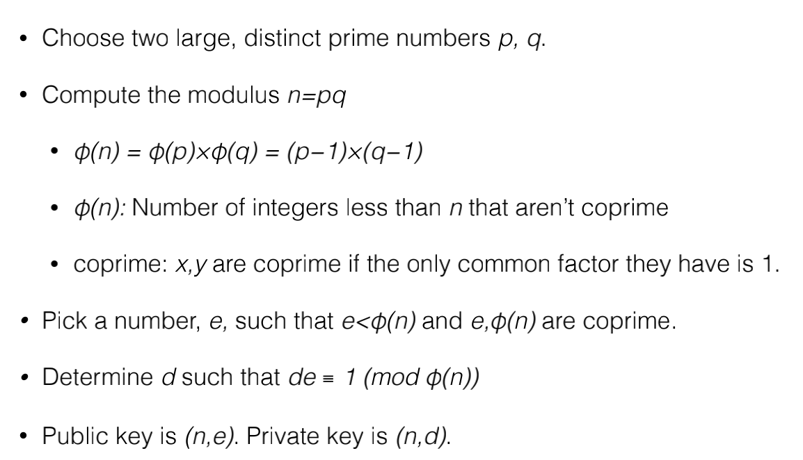

### 6.3 Unix Security

**Discretionary access control** 

Subjects

* Users

* Groups

* Processes make accesses on behalf of users belonging to particular groups

Objects

* Files, Directories

Operations

* Read, write, execute

**SUID/SGID**

SUID：If the SUID bit is set, the program is run with the permission of the program’s owner.执行文件的时候用owner的权限去执行

SGID：改文件属组的权限

### 6.4 Android Security

**Mandatory access control** 

Permissions explicitly granted by user to share data and abilities (access network, read files).

## Lecture 7 Side Channels

### 7.1 Attack Types

**Passive vs. Active Attacks**

Passive Attacks：攻击者只监听，观察信息

Active Attacks：change state，结合监听数据和更改数据

**Direct vs. Side Channel Attacks**

Direct Attacks：攻击者直接和受害者交互 eg. 钓鱼邮件；安装malware

Side Channel Attacks：攻击者会观察信息，并基于此做出推断。受害者意外地通过一些媒介泄露信息。eg. 获取用户typing；观察pin pad上的磨损模式

### 7.2 Timing Attacks

通过观察不同的执行时间长度，可以（概率地）推断出代码执行的路径。

**Classic RSA timing attack**

但是第二种算法可以根据运行时间推断出前几位是一样的，然后继续根据运行时间猜测最后的密码。

ref. http://www.tanglei.name/blog/rsa-and-timing-attack.html

防御：Make everything execute in the same amount of time ；限制猜测密码次数

### 7.3 Power analysis attacks

通过观察不同的功耗趋势，可以（概率地）推断代码执行的路径。

电路中电压的微小变化都能在示波器中显示，通过查看当前轨迹的形状，可以推断出所使用的功率和计算路径。

防御：Add random noise to computation；Use a UPS；Limit physical access

### 7.4 Meltdown/Spectre

Idea：cpu被优化为可以快速运行。在运行时检查权限，可能是在某些内容处理或存储在缓存中之后。可以欺骗缓存，使其通过缓存计时侧通道向您提供有关其内容的信息。

Cache side channel：缓存的数据比未缓存的数据获取速度更快。可以根据访问时间确定特定缓存中是否存在缓存地址。

**Flush:** Force flush of cache (running clflush)

Wait for victim to run process that stores the information from memory in cache.

**Reload:** Try to reload the data. See how long it takes.

• A long time? — cache miss. the victim didn’t access the data.

• A short time? — cache hit. the victim accessed the data.

**Meltdown**

因为CPU可以同时执行多个指令（乱序执行）

每个阶段执行的操作如下：

1）获取指令，解码后存放到执行缓冲区Reservations Stations

2）乱序执行指令，结果保存在一个结果序列中

3）退休期Retired Circle，重新排列结果序列及安全检查（如地址访问的权限检查），提交结果到寄存器

meltdown payload：

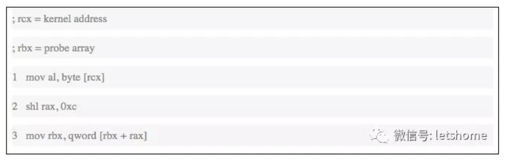

Meltdown漏洞的利用过程有4个步骤：

1) 指令获取解码

2) 乱序执行3条指令，指令2和指令3要等指令1中的读取内存地址的内容完成后才开始执行，指令3会将要访问的rbx数组元素所在的页加载到CPU Cache中。

3) 对上一步的结果进行重新排列，对1-3条指令进行安全检测，发现访问违例，会丢弃当前执行的所有结果，恢复CPU状态到乱序执行之前的状态，但是并不会恢复CPU Cache的状态

4) 通过缓存测信道攻击，可以知道哪一个数组元素被访问过，也即对应的内存页存放在CPU Cache中，从而推测出内核地址的内容

**Spectre**

当CPU发现分支预测错误时会丢弃分支执行的结果，恢复CPU的状态，但是不会恢复CPU Cache的状态，利用这一点可以突破进程间的访问限制（如浏览器沙箱）获取其他进程的数据。

具体攻击过程可以分为三个阶段：

1) 训练CPU的分支预测单元使其在运行利用代码时会进行特定的预测执行

2) 预测执行使得CPU将要访问的地址的内容读取到CPU Cache中

3) 通过缓存测信道攻击，可以知道哪一个数组元素被访问过，也即对应的内存页存放在CPU Cache中，从而推测出地址的内容。

防御Meltdown/Spectre：分区过程和特权执行；限制的使用刷新；限制分支预测

## Lecture 8 Mobile（guest lecture）

### 8.1 PLATFORM SECURITY

**Mobile OSes：**

优点：改变环境权限；更好的权限分离；OS负责高级信息/资源

缺点：访问控制策略需要用户的输入（**Least Privilege App Policy**）

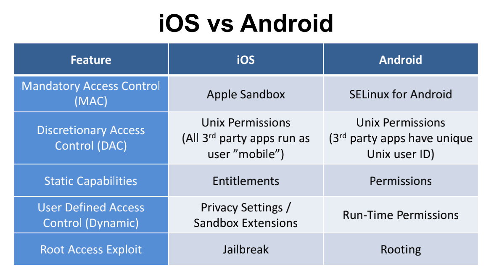

****

**iOS Sandbox Policy**

因为沙盒的存在，应用程序只能读写自己沙盒的文件，不能访问其他应用程序的沙盒，不能进行程序间通信

ref. https://www.jianshu.com/p/a7e0f799ea0a

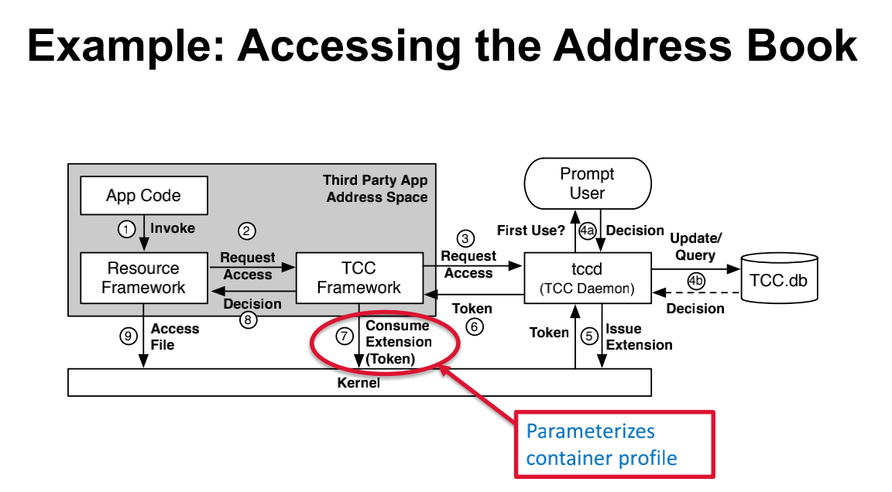

**Abusing the Address Book Privacy Setting**

* Apps directly access address book file
* System (tccd) grants sandbox extension
* Sandbox allows access to file path

**jailbreak **越狱

https://www.jianshu.com/p/c5c22f9a06e2

****

**Android Middleware**

access control会有漏洞，middleware是内联的

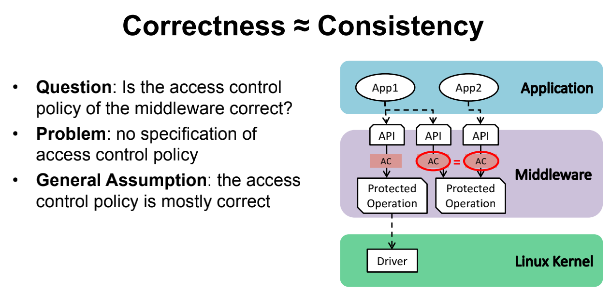

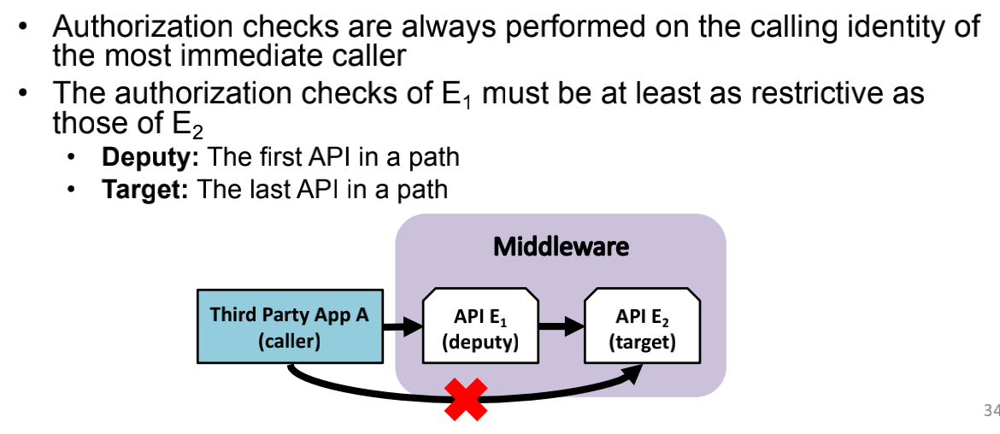

这边内容没啥好总结但，看看PPT就行，就是一些移动端攻击和防御简介

## Lecture 9 Banking

### 9.1 Clark-Wilson Model

Integrity is defined as a set of constraints: Can check that the data is consistent with those constraints. 

四种实体：

CDIs: Constraint Data Items 只能由TP操纵。

* The valid objects subject to the systems controls. 

UDIs: Unconstraint Data Items 用户可以通过简单的读写操作进行操纵。

* Objects not subject to integrity controls. 

IVPs: Integrity Verification Procedures 检查CDI与外部现实的一致性。

* Used to check that CDIs are subject to the constraints. 

TPs: Transaction Procedures 可编程的抽象操作，如读、写和更改。

* Take CDI from one valid state to another valid state.

ref. https://blog.csdn.net/junruitian/article/details/79955863

应用Clark-Wilson Model的两种规则：

* Certification rules

  CR1: When any IVP is run, it must ensure all CDIs are in a valid state.

  CR2: For some CDIs, a TP must transform those CDIs in a valid state to a valid state.

  CR3: The allowed relations must meet the requirements imposed by the principle of separation of duty

  CR4:  All TPs must append enough information to reconstruct the operation to an append-only CDI

  CR5: Any TP that takes as input a UDI may perform only valid transformations, or no transformations, for all possible values of the UDI. The transformation either rejects the UDI or transforms it into a CDI.

* Enforcement rules

  ER1: The system must maintain the certified relations and ensure that only TPs certified to run on a CDI manipulate that CDI.

  ER2: The system must associate a user with each TP and a set of CDIs. The TP may **access** those CDIs on behalf of the associated user. The TP cannot access that CDI on behalf of a user not associated with that TP and CDI.

  ER3: The system must authenticate each user attempting to execute a TP.

  ER4:  Only the certifier of a TP may change the list of entities associated with that TP. No certifier of a TP, or any entity associated with that TP, may ever have “execute“ permission with respect to that entity.

### 9.2 Chinese Wall Model

ref. https://blog.csdn.net/qq_38626043/article/details/114645674

主要功能：消除利益冲突，防范信息外泄

每个object都有一个label表示它的origin，eg.  “Pepsi Ltd.”, “Coca-Cola Co.” “Microsoft Audit”, “Microsoft Investments”

originator定义了标签的“冲突集”。eg.  {“Pepsi Ltd.”, “Coca-Cola Co.”} and {“Microsoft Audit”, “Microsoft Investments”}

**Rules：**

访问客体的控制：

* 与主体曾经访问过的信息属于同一公司数据集合的信息，即墙内信息可以访问。
* 属于一个完全不同的兴趣冲突组的可以访问。

主体能够对一个客体进行写的前提，是主体未对任何属于其他公司数据集的访问。

* 定理1：一个主体一旦访问过一个客体，则该主体只能访问位于同一公司数据集的客体或在不同兴趣组的客体
* 定理2：在一个兴趣冲突组中，一个主体最多只能访问一个公司数据集

Chinese Wall安全策略主要包括三大信息存储模块：

某家企业的单位信息（C）
该家企业的所有信息集合（Company Data，CD）；
该家企业与互为竞争关系企业的全部信息集合（Conflict of Interest，COI ）。
该模型规定
每个C只能唯一对应一个CD；
每个CD只能唯一对应一个利益冲突类COI；
一个COI类却可以同时包含多个CD。

### 9.3 SWIFT

Assets = Liabilities负债 + Equity股权

Separation of Responsibility：让不同的人统计收入和支出

因为最开始的银行用电报传递信息，电报消息是由中间操作员传递的，因此消息很容易受到操纵。银行使用了一种称为test keys的基本哈希函数来确保消息的完整性。

但是不能抵抗CPA，test keys缺乏对双重控制的支持和对密码分析的脆弱性，促使人们改用SWIFT。

**SWIFT**

本质上是一个具有内置加密、身份验证和不可拒绝验证的电子邮件系统

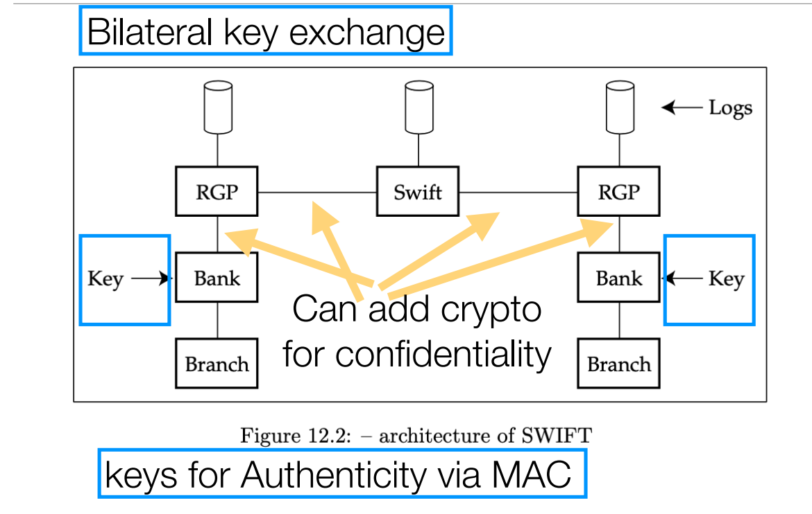

Non-repudiation不可否认性：

银行将消息发送到他们的RGP，RGP记录消息，并将消息转发到swift。swift记录这个消息并转发给接受者的RGP，接受者的RGP在分发前记录这个消息。

银行如果想否认这笔交易，将不得不与两个rdp(通常在不同国家)和SWIFT串通

### 9.4 ATMs

Automatic Teller Machines (aka Cash Machines)

Each ATM card has a PAN and expiration date, PIN encrypts the PAN

Dual Control：在HSM（hardware security module）中完成的明文密码和密钥的操作；卡和PIN通过单独渠道发送给客户；ATM终端主密钥分割，由两名银行官员提供；离线PIN验证，PIN密钥KP用终端主密钥加密，从银行发送到ATM；在线PIN验证，PIN使用终端主密钥加密并发送到银行；为了接受其他银行的卡，PIN使用终端主密钥加密并发送到银行，然后由HSM使用与网络共享的密钥重新加密。

## Lecture 10 Economics, other factors, and wrapup

这一节和ppesp内容挺像

### 10.1 Cyberwar

不重要，介绍了点网络战争的事件和辩论。

### 10.2 Economics

经济学模型：

* 分析模型：对代理人的行为提出合理的假设，然后研究其含义。适用于个人行为的理论分析，When models disagree, ground truth is elusive

* 经验模型：在总体上观察关系，而不解释潜在的个人决定。基本的真相是可以实现的，但这些可能过于简化，不能解释潜在的机制

* 测量模型：收集数据来比较分析模型的预测偏差。直接将实证分析应用于分析模型通常不可行。能提供反馈。

**Rational choice axioms**

Notation 

• o1 ≻ o2: the agent is strictly prefers o1 to o2.

• o1 ≽ o2: the agent weakly prefers o1 to o2;

• o1 ∼ o2: the agent is indifferent between o1 and o2; 

前提假设：理性选择理论假设人们对结果的偏好是一致的。

**Completeness**：For each pair of outcomes o1 and o2, exactly one of the following holds: o1 ≻ o2, o1 ∼ o2, or o2 ≻ o1. 也就是结果是可比的。

**Transitivity**. For each triple of outcomes o1, o2, and o3, if o1 ≻ o2 and o2 ≻o3, then o1 ≻o3. 结果可传递

**平衡confidentiality 和availability**

Outcomes O

• c⊕: mechanism achieving high confidentiality 

• c⊖: mechanism achieving low confidentiality

• a⊕: mechanism achieving high availability

• a⊖: mechanism achieving low availability 

Indifferent: (c⊕, a⊖) ∼ (c⊖, a⊕). 

为了比较上述这些，需要用具体数值。

A **utility function** U maps a set of outcomes onto real-valued numbers, that is, U : O → *R*. U is defined such that U(o1) > U(o2) <====> o1 ≻ o2 . 

eg. 两种utility函数：U(o1, o2) = u · o1 + v · o2；U(o1, o2) = min{u · o1, v · o2} 

存在缺陷：人们采取的行动很少直接决定结果。相反，不确定的是会出现什么样的结果更现实的模型:agent从所有可能的动作a中选择动作a，然后结果O与概率分布相关联

### 10.3 Risk Management

Risk acceptance：以下情况风险是可接受的：最坏情况下的损失很小，足以用收益或准备金来支付；发生的概率比威胁组织生存的其他商业风险要小

Risk mitigation： reduce the probability and severity of a loss 

Risk avoidance：然而，与其使用技术，不如放弃有风险的活动。这就引入了失去业务的机会成本

Risk transfer：买保险

eg. Credit card issuers regularly manage fraud 

•Risk acceptance: fraud is paid from the payment fees charged to merchants

•Risk mitigation: install anti-fraud technology (raises costs of security)

•Risk avoidance: downgrade high-risk cardholders to debit or require online verification (leads to lost business)

•Risk transfer: structure consumer credit risk and sell it on the market 
