# COMP55 NOTES

[toc]

## Week1

### TCP/IP overview

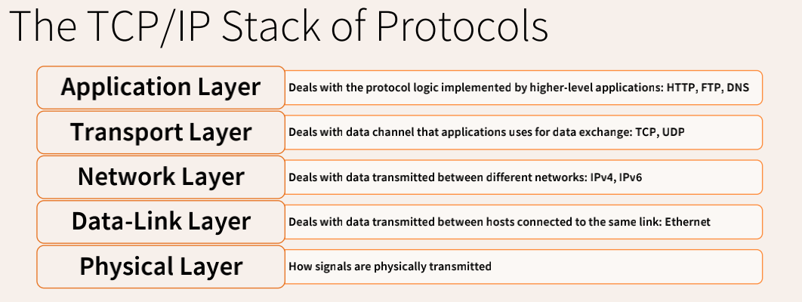

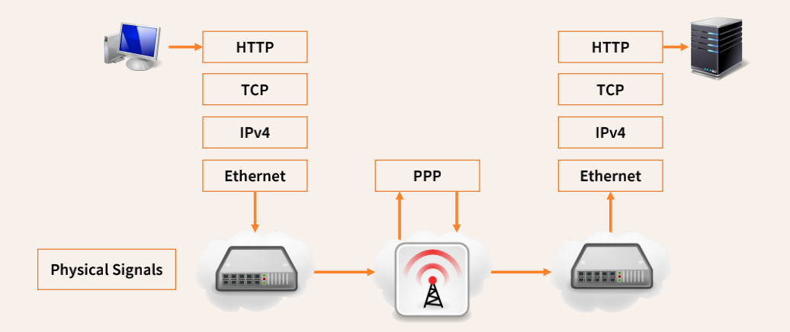

### IPv4 overview

#### IPv4数据包格式

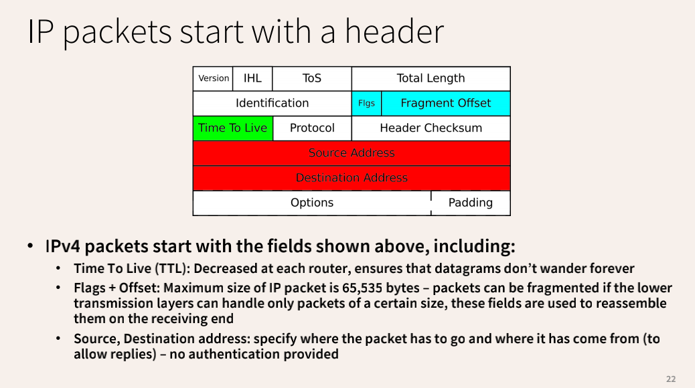

#### Traceroute

Traceroute (Windows 系统下是tracert) 命令利用ICMP 协议定位计算机和目标计算机之间的所有路由器。Routers decrement the TTL by one every time they route a datagram. If TTL reaches 0, the datagram is discarded and a “ICMP Time Exceeded” packet is sent to the sender.

⚠️Some hosts may block packets needed for traceroute to work.

**MPLS protocol**: 用标签转发，而不是进行IP路由表的查找

**Ping of Death**: Lower layer protocols may be unable to transmit packets as large as the IP packet size (65,535 bytes). For this reason, packets can be split in multiple fragments. ➡️ Problem: the recipient operating system has to receive all fragments before it can reassemble them – the total datagram length is not known a priori. ➡️ Total length can be higher than 65,535 bytes and can overflow a static buffer：

```
ping –l 65510 192.168.0.123
```

### ICMP

是TCP/IP协议簇的一个子协议，用于在IP主机、路由器之间传递控制消息。控制消息是指网络通不通、主机是否可达、路由是否可用等网络本身的消息。

### NAT

NAT shares the same IP address between several hosts to deal with IPv4 shortages.

****

**同一个网络下**的IP数据包转发不需要路由器，用MAC地址在数据链路层进行转发。Hosts can sniff traffic on their network segment by entering “promiscuous mode”. 

### MAC

MAC地址（Media Access Control Address），也称为局域网地址（LAN Address），MAC位址，以太网地址（Ethernet Address）或物理地址（Physical Address）。在OSI模型中，第三层网络层负责IP地址，第二层数据链路层则负责MAC位址。MAC地址用于在网络中唯一标示一个网卡，一台设备若有一或多个网卡，则每个网卡都需要并会有一个唯一的MAC地址。

### ARP (IP和MAC的对应关系)

The Address Resolution Protocol (ARP) is used by hosts to know which MAC address is associated to which IP address on the local link.

<font color='red'>【问题】</font> Issues with ARP Spoofing

Race condition: legitimate ARP replies might restore the IP / MAC mapping. Attackers continuously send spoofed ARP replies to keep the fake mapping.

<font color='green'>【解决方法】</font> Switched Ethernet

The switch keeps a mapping of which host (MAC address) is connected to which port.

这个可以解决sniff的问题

<font color='red'>【仍存在问题】</font>

* ARP spoofing is still a problem: attackers can make the switch believe that a host is connected to a different port.
* MAC flooding: MAC / port mappings are stored in a table, if the table is filled some switches will start forwarding all traffic to all ports.（在典型的MAC flooding中，攻击者能让目标网络中的交换机不断泛洪大量不同源MAC地址的数据包，导致交换机内存不足以存放正确的MAC地址和物理端口号相对应的关系表。如果攻击成功，交换机会进入failopen模式，所有新进入交换机的数据包会不经过交换机处理直接广播到所有的端口（类似HUB集线器的功能）。）

****

**不同网络下**数据包转发需要路由。

### BGP

The Border Gateway Protocol (BGP) is the protocol used by Internet Service Providers to tell each other which IP addresses they own.

Different networks on the Internet are called **Autonomous Systems (ASes)**.

<font color='red'>【存在问题】</font>

BGP advertisements are not authenticated so can be spoofed, resulting in route hijacking. 利用漏洞 ➡️ If two routes conflict, the one that covers the smaller IP space wins. Attackers advertise multiple small advertise.

<font color='green'>【解决方法】</font>

* Authenticating BGP routes – Resource Public Key Infrastructure (RPKI) 

* Having routers decide if an advertised route looks anomalous[异常的] (arms race)

****

### IPSec

 IPSec can authenticate and encrypt every IP packet（验证header，加密报文）

* Security Association (**SA**): defined before communication is started (between endpoints) – specifies algorithms used for authentication and encryption, and exchanges keys through the IPSec Key Exchange (IKE)
* Authentication Header (**AH**): extension to IP that provides authentication and integrity of datagrams, plus a timestamp prevents replay attacks
* Encapsulating Security Payload (**ESP**): extension to IP that provides authentication, integrity, and confidentiality (encryption)

两种模式：

* Transport Mode

  直接加在源数据包中间。不支持NAT：因为如果采用 Transport 连接一端是网关的时候，网关有 NAT 功能，会将地址变换，而Transport Mode是只识别原 IP 的，这样就会被直接丢弃掉。

  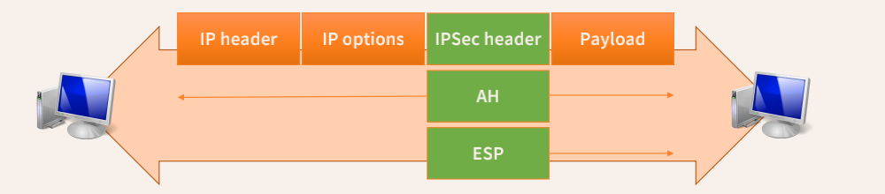

* Tunnel Mode

  在源数据包外新建一个数据包头，可以隐藏源IP地址。

  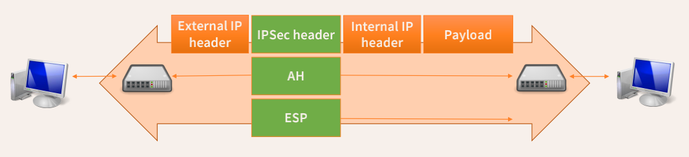

### IPv6

IPv4 addresses are 32 bit long

IPv6 addresses are 128 bits long

<font color='red'>【存在问题】</font>

* 技术不是很成熟，存在一定bug
* IPv6可以绕过为IPv4设计的控制
* 没有NAT存在隐患

<font color='green'>【存在优势】</font>

* scanning IPv6 is hard.
* Autoconfiguration used to include MAC address in IP address, which has privacy implications.


## Week 2

### UDP(User Datagram Protocol )

在IP上增加了端口号（port number），通常丢几个包不要紧，所以用来传输视频或语音。

**使用UDP传输的协议**

* Domain Name System (DNS, port 53)

  但是DNS查询超过512字节的时候，使用TCP传输，因为TCP可以分fragment传输。

* Dynamic Host Configuration Protocol (DHCP, ports 67, 68)

* Hypertext Transport Protocol HTTP/3 (port 443) 

  因为这个使用了额外的QUIC保障传输

* µTP (BitTorrent, multiple ports) 

  网络超载时会自行降低速度

**UDP spoofing**

local network：UDP spoofing / hijacking（攻击者网络嗅探到request包，然后在服务器发送UDP数据包之前发送伪造的UDP reply 数据包到目标）

remote target：blind UDP spoofing（看不到content，猜测request在什么时候）

**UDP portscan**

发送空的UDP数据包到每个端口，如果端口没开放，会返回ICMP。用这种方法来猜测应用程序可能在哪些端口上运行。

<font color='green'>【应对portscan】</font>：一些操作系统限制发送ICMP包的频率

Sweeping：扫描多个hosts的某个相同的端口（for example to see which hosts on a network are running a webserver）

### TCP

面向连接的服务，不会丢包，网络拥堵时自动降速，correct ordering segments

source port is randomly picked by the client, destination port is the one the target service is listening on.

**使用TCP传输的协议**

* Hypertext Transport Protocol HTTP/0,1,2 (port 80)，HTTPS port 443

*  Telnet – port 23, Rlogin – port 513（source port）

  不加密的远程连接到别的电脑上

* Secure Shell (SSH) – port 22

  加密连接

* Simple Mail Transfer Protocol (SMTP) – port 25

  邮件系统

* Internet Message Access Protocol (IMAP) – port 143

  Use for clients to access a mailbox stored on a mail server

**TCP 数据包解析**

* Sequence number：每个segment的位置
* Acknowledgement number：最后一个数据包的位置
* Window: 只接受在window范围内的segments
* Checksum：数据包完整性
* flags
  * SYN：请求连接，想要得到ack回复
  * ACK：确认收到了segment
  * FIN：请求关闭连接（不强制）
  * RST：强制关闭连接
  * PSH：requests to pass the data stream to the user level (program) as soon as possible
  * URG：data is urgent

**SET UP TCP connections**

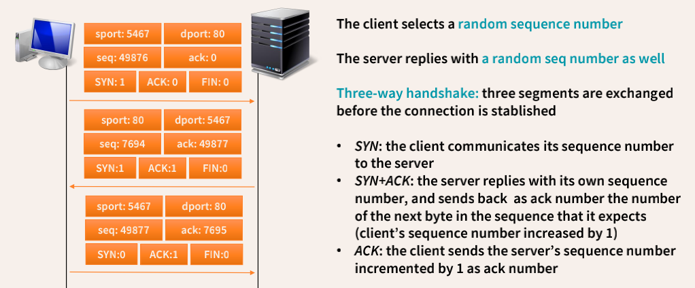

**TRANSFER TCP data**

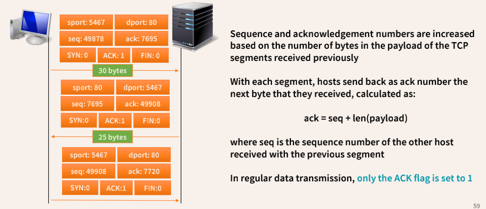

**CLOSE TCP connection**

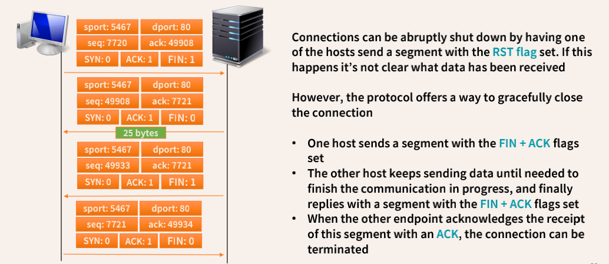

### TCP Security

**TCP spoofing**：sequence number使得TCP spoofing变得困难。

sequence number不能太随机：Purely random sequence numbers is ideal for security, but could lead to confusion if two connections end up with sequence numbers that are close to each other.

**TCP Hijacking**：攻击者向server发送数据包，server向用户发送ack数据包，但是sequence number没有办法对应上，an infinite loop of segments is generated – ACK storm。某种情况下丢包了会使网络重新安静下来，但攻击者可以继续发送数据包，造成下一次ACK storm。

⚠️original Linux TCP implementation中TCP数据包在某个范围区间都会被接纳——blind RST attacks and data injection attacks。RFC 5961 reduces the window of acceptable segments，如果数据包不在这个区间，会发送一个challenge ACK。攻击者可以利用这些实现测信道攻击以猜测sequence number。

**TCP portscan类型**

* connect() scan：三次握手建立完整连接

  if the handshake is successful the port is open

* SYN scan：半开放连接，发送 SYN

  open：SYN + ACK segment

  close：RST

* FIN scan：发送FIN

  open：ignore

  close：RST

* XMAS scan：segments with FIN, PSH, URG flags set

*   Null scan：segments with no flags are sent

* **Idle scanning（利用第三方实现攻击，更加隐蔽）**

  Step 1: 攻击者发送SYN+ACK，获得idle的ipid1（RST包，因为僵尸主机发现非法响应，所以发送RST数据包）

  Step 2: 攻击者发送SYN到目标地址（假冒idle发的）

  Step 3: 攻击者发送SYN+ACK，获得idle的ipid2

  open：ipid2=ipid1+2

  close：ipid2=ipid1+1

同时，扫描还能获得一些其他的信息（week2 PPT page.68）

**Initial sequence numbers的随机性质**

生成算法，每段时间rekey，保证前十五位不会相同，只有后十五位是真随机


### DNS and TLS security

**DNS**

用来匹配域名和具体ip地址

两种DNS servers：

* Recursive servers
* Authoritative servers：存了IP-domain的映射

The DNS system is organized as a hierarchical tree: root servers → top level domain servers → second level domain servers etc.

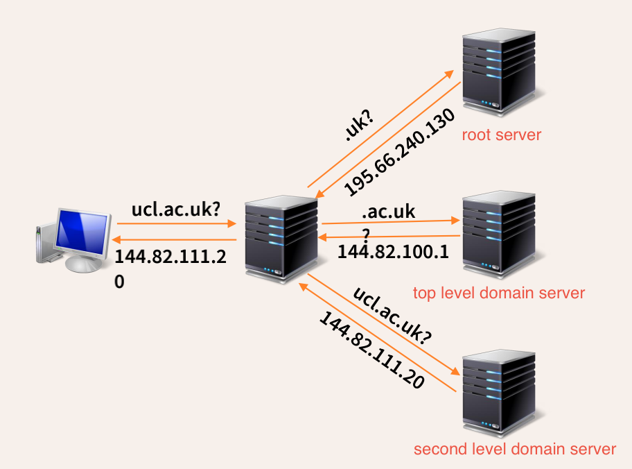

大多数情况下，root server会接受太多请求，可能会有网络用塞。所以设置cache存储一些records（在recursive serves上，一次请求会返回请求对DNS地址，同时还会返回其他一些DNS地址，下次请求会直接在这些地址里找），就不用request整个DNS层次，同时还能确保安全（因为顶层server看不见用户的请求信息）。

**DNS 安全性**

<font color='red'>【存在问题1】</font>

DNS基于UDP，所以也可能遭受UDP相关的攻击。eg. spoof DNS reply可以将其他domain redirect到自己的IP address上。

<font color='green'>【解决方案1】</font>

DNS requests include a 16-bit ID that identifies them （对local network没用，但是对remote network有用）

<font color='red'>【存在问题2】</font>

cache poisoning：在cache里存储相关DNS record时，不检查这个reponse的来源。攻击者可以植入假的DNS record。

<font color='green'>【解决方案1】</font>

DNS clients must ensure that DNS responses are relative to the domain that they queried.

**Kaminsky漏洞**：攻击者向Recursive servers发送不存在域的DNS查询，然后，解析程序将查询转发到Authoritative servers，以获取错误domain的IP地址。此时，攻击者向Recursive servers注入了大量伪造的响应，希望这些伪造之一与原始查询的16-bit ID相匹配。如果攻击成功，则攻击者已使用伪造IP地址毒害了Recursive servers的DNS缓存。直到TTL为止，请求这一domain的人都将获得伪造的IP地址。

能成功的原因：birthday paradox（If a random function yields results in a range H with equal probability, after 1.25 $\sqrt𝐻$ elements there is a 50% chance that two of the previously observed elements were the same）

DNS参考链接：https://zhuanlan.zhihu.com/p/144183767

**DNS 安全措施**

* 随机source port
* 随机域名的大小写
* DNSSEC 加密验证

****

**TLS**

用公钥加密进行验证，用certificate商订一个对称加密密钥。

Advantage：prevents spoofing and hijacking，因为密钥只能用私钥解密。

Disadvantage：如果certificates没有验证的话很容易遭到MITM攻击；攻击者可以在browser中插入假的CA certificate。


## Week 3

**Legality and ethics**：这节没啥用，不要紧。

### Firewalls

* Packet filters

  过滤类型：IP地址；协议（eg. TCP，UDP等）；port；TCP flags

  作用：限制网络流量端口；禁止欺骗IP address的数据包离开网络；丢弃不属于连接内部的数据包；限制连接速率。

  **DMZ**(Demilitarized Zone)：为了解决安装防火墙后外部网络的访问用户不能访问内部网络服务器的问题，而设立的一个非安全系统与安全系统之间的缓冲区。在这个小网络区域内可以放置一些必须<u>公开的服务器设施</u>，如企业Web服务器、FTP服务器和论坛等。另一方面，通过这样一个DMZ区域，<u>更加有效地保护了内部网络</u>。因为这种网络部署，比起一般的防火墙方案，对来自外网的攻击者来说又多了一道关卡。

  <font color='red'>【存在缺陷】</font>Packet filters对application-level protocol没有作用。攻击者可以在合法协议里封装其他协议——DNS tunneling（通过将其他协议封装在DNS协议中传输建立通信。因为大部分防火墙和入侵检测设备很少会过滤DNS流量）。

  <font color='green'>【解决方案】</font> Application gateways

* Application gateways

  STEP1：防火墙启动多个proxy program并禁止application-level connection，每个proxy表达一个application-level protocol

  STEP2：proxy在application-level traffic上应用一些安全策略

  STEP3：proxy禁止规避了Packet filters的意义不明的packets

### Intrusion detection

Intrusion detection其实是防火墙之后的第二道屏障。

一些名词解释：

> 中继端口（trunk port）：在一个交换机端口允许一个或者多个VLAN通信到达网络中相连的另一台交换机上相同的VLAN中。
>
> 网路分流器(Network Tap)：也叫做测试接入端口(TAP，Test Access Port)，直接插入到网络电缆和发送一份网络通信给其它设备。在网络交换中也称作端口镜像。

IDS需要了解整个网络：通过trunk port和Network Tap

IDS类型：

* Misuse-based

  基于它们与以前看到的攻击的相似性来识别的。将收集到的数据与预先确定的特征知识库里的各种攻击模式进行比较，如果发现有攻击特征，则判断有攻击。

  <font color='green'>【优点】</font>很少假阳性；快速

  <font color='red'>【缺点】</font>完全依靠特征库来做出判断，所以不能判断未知攻击；需要持续更新；

* Anomaly-based

  根据异常行为和使用计算机资源的情况检测入侵。基于异常检测的入侵检测首先要构建用户正常行为的统计模型，然后将当前行为与正常行为特征相比较来检测入侵。
  
  <font color='green'>【优点】</font>可以检测出未知攻击；不需要更新
  
  <font color='red'>【缺点】</font>难以配置；很多假阳性；细节不够

**False positive/False negative**

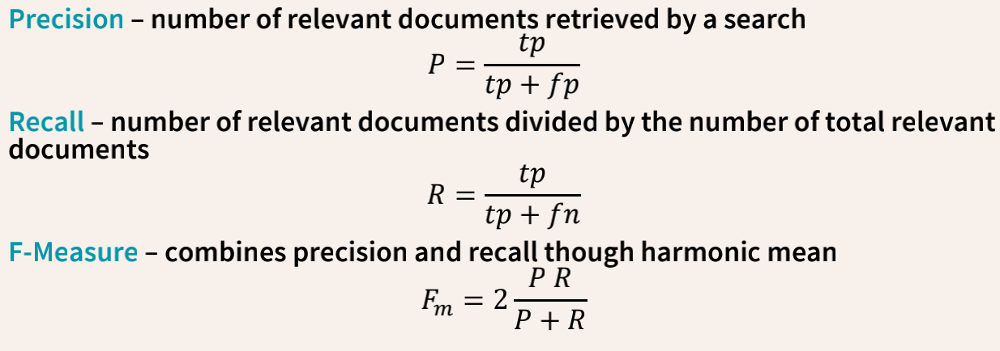

precision：预测为正确的数据中，真实值为正确的比例

recall：真实为正确的数据中，预测对了多少

F-Measure：平衡上面两个值，因为上述两者都不是我们想要的，所以我们需要权衡两者，才能找到最优秀的模型

**ROC曲线**：平面的横坐标是false positive rate(FPR)，纵坐标是true positive rate(TPR)。

人们总是希望能有一个数值来标志分类器的好坏。于是Area Under roc Curve(AUC)就出现了。AUC的值就是处于ROC 曲线下方的那部分面积的大小。

**Intrusion detection implementation**

Snort is an open-source real-time network-based intrusion detection system – based on libpcap，包含了packet filter。

IDS vs. IPS

IDS：通过trunk port检测攻击，但是不能防御。

Intrusion Prevention System (IPS) ：deployed inline and analyses live traffic，可以防御。

<font color='red'>【IDS缺点】</font>

* 如果用了DMZ，需要为每一块区域分配一个IDS；

* 嗅探包裹可能被丢弃；

* 使用加密的时候IDS就无用了；

* IDS和终端处理包的方式可能不一样；

  An IDS might accept a packet that the end system will reject.

  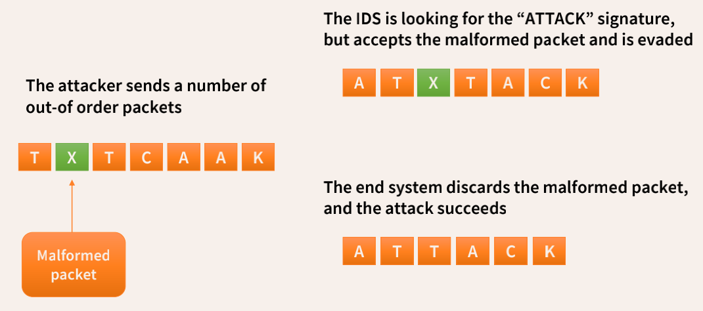

* decoy attack。

A wide range of techniques are available to confuse an IDS into missing an attack 

• The destination host may not accept TCP segments bearing certain options

• The destination host might drop packets with old timestamps

• The destination host may not check sequence numbers on RST packets

Partial solutions

• Take into account the OSes of the target systems

• Take into account the installed services and their configuration

• Deploy a “normalizer” module that blocks malformed packets

Problem: IDSs should be easily deployable.

### Alert correlation

攻击其实很rare，即使降低了假阳性，但是还是很存在很多alert。所以，从IDS检测到的各种攻击步骤中获得“big picture”→Alert correlation。

Alert correlation结合了多个警报和上下文信息来对操作进行优先级排序。

步骤：

* Normalization

  不同sensors给出的alert格式不一样，把这些alert转化为同一个格式

* Fusion

  把针对同一个event的（而且是同一种attack的，但是来自不同sensor）alert融合起来

* Alert verification

  验证该attack是否成功，也就是降低假阳性

* Thread reconstruction

  把针对某个目标，来自同一个攻击者的attack结合起来

* Attack session reconstruction

   links network-based alerts to host-based alerts（基于主机的入侵检测系统可以检测内部变化（例如，员工意外下载并在您的系统内传播的病毒），而基于网络的 IDS 将检测恶意数据包进入您的网络或您的异常行为网络，例如flood攻击）

* Focus recognition

  检测哪个source或target在很多攻击中出现

* Multi-step correlation

  综合多个events来查看攻击者策略——higher level attack patterns

* Impact analysis

  攻击结果和影响（eg. mail, DNS down）

* Prioritization

  看哪个alert比较严重

<font color='red'>【Alert correlation缺点】</font>

* 难以分析
* 难以比较
* 很难将alert与发生在网络中的“任务”和网络中的关键主机关联起来
* 工具需要与熟练的操作人员和支持它们的环境相结合

Security Information and Event Management (SIEM)： provide real time analysis of security alerts, providing insights to network administrators. SIEMs perform alert correlation, and provide a dashboard to explain what’s happening on the network.

需要结合IDS和SIEM

### Denial of Service

– DoS bug: Design flaw allowing one machine to disrupt a service

– DoS flood: Command botnet to generate flood of requests

**Wireless Internet (802.11) **：

* 无线电干扰，影响信噪比【不是关注重点】
* Protocol DoS bugs
  * NAV (Network Allocation Vector)：相当于一个计数器，用来虚拟的反映信道的忙与闲，非0为忙，0为闲。任何节点都可以预留通道#NAV秒，在这段时间内其他节点不能transmit。
  * De-authentication bug：任何节点都可以发送de-auth数据包到AP，攻击者重复发送de-auth数据包实现攻击。

**Smurf attack**

机制：发送ping request到broadcast地址，在目标网络上的所有主机都会发送ping reply。

<font color='green'>【prevention】</font> 拒绝外部数据包传送到broadcast地址

### TCP DoS

前面TCP有简介，这里就不整了，回过去看前面内容。基于TCP三次握手。

**TCP SYN-flood attack**

用随机到source IP发送syn数据包，不继续建立连接，Exhausts state rather than bandwidth

<font color='green'>【prevention】</font> 

* Syncookies: remove state from server【只能解决low-rate】

  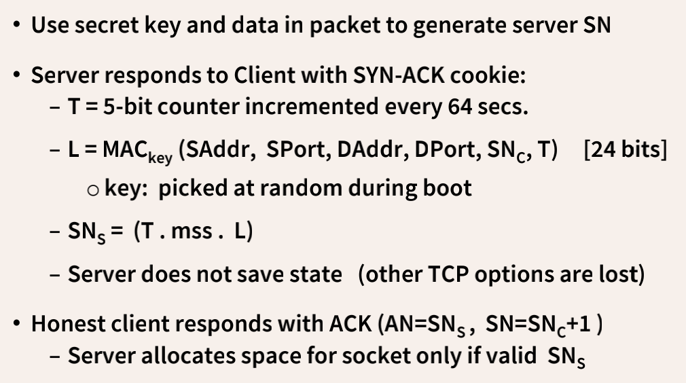

  只有client有正确的SN回复，才会分配空间。

  <font color='red'>【缺陷】</font> SYN floods overwhelm bandwidth

* 减小性能开销。

* blocked DoS traffic from servers：只允许建立完整的TCP链接

  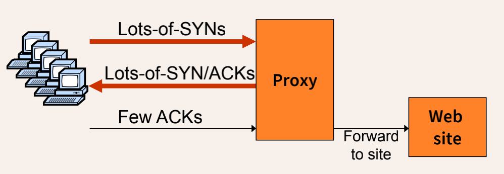

**TCP connection flood**

完整建立了三次握手，然后重复发送 short HTTP HEAD request。这会绕过SYN flood的保护措施。但是这里攻击者不能用random ip了，会暴露肉机的地址，防御措施只需要block or rate-limit bots.

### DNS DoS

一般攻击root DNS，因为危害更大。

<font color='green'>【prevention】</font> 

* CoDoNS：Cooperative Domain Name System
*  P2P design for DNS system: DNS端点共享load，向后兼容（技术能够在不使现有技术过时的情况下向前发展）

**SSL/TLS handshake**：这种情况下RSA-encrypt speed = 10 x RSA-decrypt speed，Single machine can bring down ten web servers

**Send HTTP request for some large PDF file**：Easy work for client, hard work for server.

### DoS总结

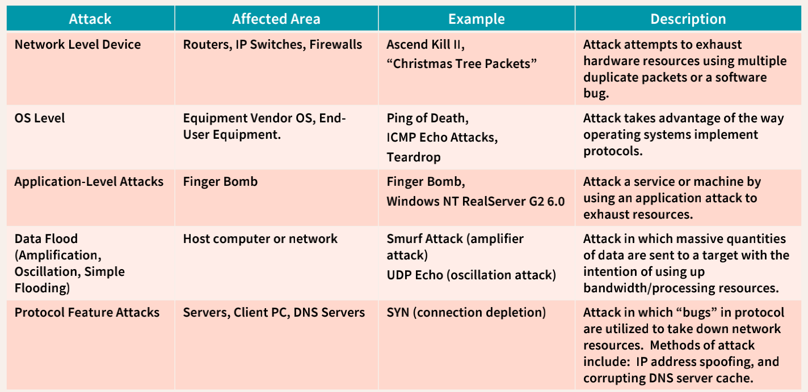


## Week 4

### DoS Mitigation

降低攻击者的攻击速度，于是提出了用户提交puzzle solution，这种puzzle一般是计算难但是检测容易（有点像计算区块链里的nonce）。在DoS攻击发生的时候，每个人都需要计算puzzle，如果没有DoS攻击，则不需要。

$LSB_n ( SHA-1( C || X ) ) = 0^n $ 给定C计算X

<u>Example</u>

*  TCP connection floods：C=TCP server-seq-num，第一个data packet必须包含puzzle solution
*  TLS handshake DoS：C based on TLS session ID，服务器中RSA解密前检测puzzle solution

Client puzzles的难度取决于n的大小

<font color='red'>【Client puzzles局限性】</font> 客户端和服务端都需要改变；会伤害低功耗合法客户端（没有计算能力）；DDoS的攻击者有更多算力。

****

Memory-bound functions

因为puzzle会伤害低功耗合法客户端（没有计算能力），所以（根据算力给出相应puzzle）

<font color='green'>【解决方案】</font>Solution requires many main memory accesses

****

CAPTCHA：人工验证码，以抵抗自动攻击

### Source identification

提出问题：DDoS with spoofed source IPs怎么找到数据包来源？

主机和internet中间加入一个ISP⬇️

Ingress filtering policy: ISP only forwards packets with legitimate source IP

**Traceback**

用routers记录packets的info。确定attack packets的path，后续采取block或者report的手段。

把path写进packet里：每个route把自己的ip写进packet，这样就能读到路径了。

<font color='red'>【存在问题】</font> packet需要write的空间

<font color='green'>【解决方案】</font> Store one link in each packet：固定存储空间，每个router有一定概率存储自己的ip。因为DDoS同一条路径会发送很多数据包。

**Edge sampling**

Data fields written to packet:

– Edge: start and end IP addresses

– Distance: number of hops since edge stored

Marking procedure for router R

if coin turns up heads (with probability p) then

​	write R into start address

​	write 0 into distance field

else

​	if distance == 0 write R into end field

​	increment distance field

当收到足够的packets，可以构建出整个path，因为每个(s,e,d)表示一个edge

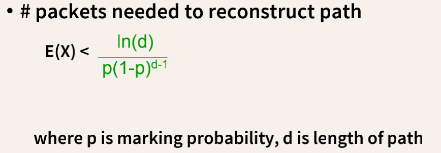

也不知道咋推的，反正肯定不考咋推。

<font color='red'>【提出问题】</font> 已经知道可以用edge sampling了，那么这个数据应该存在IP格式的哪里？

<font color='green'>【解决方案】</font> Identification field用来fragmentation，一般用不到16bit这么多，所以可以分一点存edge sampling的数据

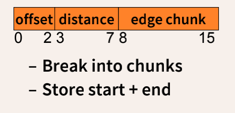

### Web security

HTTP是无状态的，因此应用程序必须构建自己的会话和身份验证

**Threat Model**

* Web attacker

  Controls a malicious website

* Network attacker
  * Passive: wireless eavesdropper（无线窃听）
  * Active: evil Wi-Fi router, DNS poisoning

* Malware attacker
  * Malicious code executes directly on victim’s computer
  * To infect victim’s computer, can exploit bugs (e.g., buffer overflow) or convince user to install malicious content
  * Masquerade（伪装） as an antivirus program, video codec, etc.

### Javascript

基础略

<font color='red'>【存在risk和prevention】</font> 因为可以运行来自internet的code

* Unknown code is downloaded to machine

* JavaScript sandbox：没有权限访问别的程序

* 同源策略约束不可信的JavaScript代码

  同源才能互相访问；每个frame都和一个domain联系（如果一个frame包含外部代码，则该代码将在frame domain执行，即使它来自另一个主机）

  <font color='red'>【存在问题】</font> ：浏览器漏洞；multiple parties on same site（同源策略没法保护）

  CORS允许通过声明来修改同源策略，CORS-enabled servers could reject a request based on the “Origin” header or respond with an access control header

### Cross-site request forgery (CSRF)

攻击者通过伪造用户的浏览器的请求，向访问一个用户自己曾经认证访问过的网站发送出去，使目标网站接收并误以为是用户的真实操作而去执行命令。

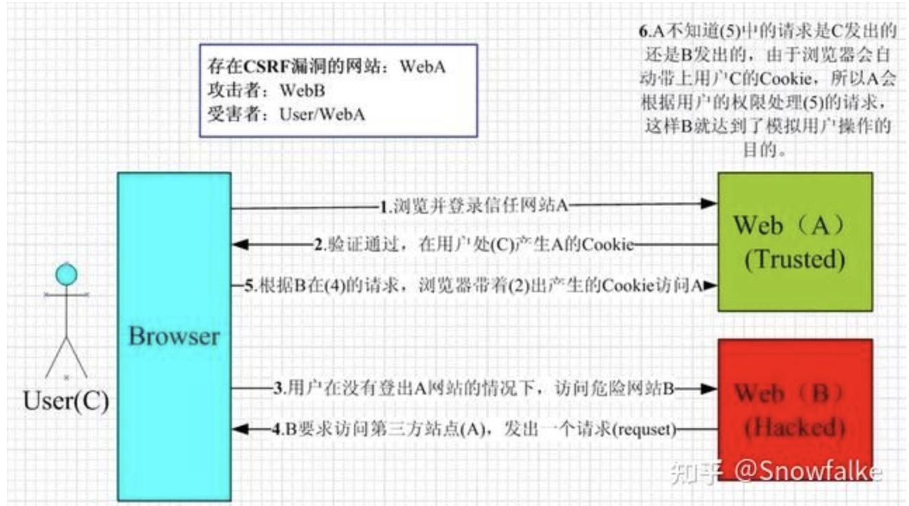

**主要原因：cookie不会马上过期，攻击者可以利用cookie来伪装成用户**

****

**Home routers**

<font color='red'>【存在问题】</font> ：弱认证，无密码或者密码相同

<font color='green'>【防御措施】</font> ：firewall，只能从内部网络中登入

<font color='red'>【仍然存在问题】</font> ：CSRF可以假冒内部网络的PC发送request

****

<font color='green'>【防御措施】</font> ：

* Secret Validation Token

  随机改变token

* Challenge Response

  CAPTCHA；Re-Authentication (password)

* Referer Validation

   if source of form is as expected

  <font color='red'>【存在问题】</font> ：可能泄漏隐私信息；网站无法阻止部分类型的用户

* Custom HTTP Header 

  只能用于同源请求


## Week 5

### Cross Site Scripting (XSS)

https://blog.51cto.com/u_6491481/3297866

由于有的服务器并没有对用户的输入进行安全方面的验证，攻击者就可以很容易地通过正常的输入手段，夹带进一些恶意的HTML脚本代码。当受害者的浏览器访问目标服务器上被注入恶意脚本的页面后，由于它对目标服务器的信任，这段恶意脚本的执行不会受到什么阻碍。而此时，攻击者的目的就已经达到了

用来绕过同源检测：如果用户被引诱从受信任的站点下载恶意代码，相同源策略机制将失败。

分为两类：

* Reflected attacks

  反射型XSS，又称非持久型XSS。之所以称为反射型XSS，则是因为这种攻击方式的注入代码是从目标服务器通过错误信息、搜索结果等等方式“反射”回来的。而称为非持久型XSS，则是因为这种攻击方式具有一次性。攻击者通过电子邮件等方式将包含注入脚本的恶意链接发送给受害者，当受害者点击该链接时，注入脚本被传输到目标服务器上，然后服务器将注入脚本“反射”到受害者的浏览器上，从而在该浏览器上执行了这段脚本。

* Stored attacks

  存储型XSS，又称持久型XSS，他和反射型XSS最大的不同就是，攻击脚本将被永久地存放在目标服务器的数据库和文件中。这种攻击多见于论坛，攻击者在发帖的过程中，将恶意脚本连同正常信息一起注入到帖子的内容之中。随着帖子被论坛服务器存储下来，恶意脚本也永久地被存放在论坛服务器的后端存储器中。当其它用户浏览这个被注入了恶意脚本的帖子的时候，恶意脚本则会在他们的浏览器中得到执行，从而受到了攻击。

**如何引导用户到compromised page**

* Reflected attacks

  当用户被欺骗点击恶意链接或提交特别制作的表单时，注入的代码会传输到脆弱的web服务器， 这将攻击反映回用户的浏览器中。

  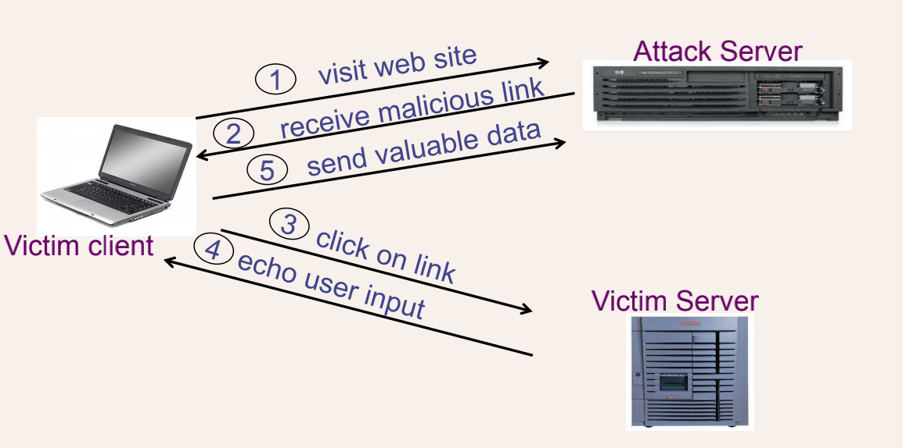

* Stored attack 

  存储攻击要求攻击者将恶意脚本存储在一个易受攻击的网站上，然后受害者下载，查看包含攻击者输入的页面。

  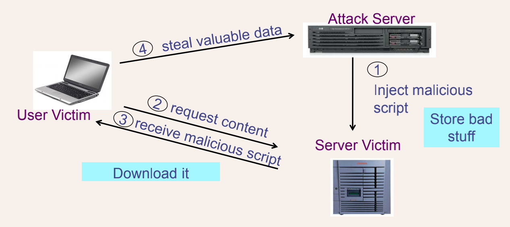

### XSS prevention

* Validation

  Validate all headers, cookies, query strings, form fields, and hidden fields (i.e., all parameters) against a rigorous specification of what should be allowed

  标准化内容，以避免difficult encoding

* Don’t try too hard

  不要试图识别active content并删除、过滤。有太多的active content类型和太多的encoding方式来绕过过滤器。

  只允许安全的命令（如，不允许\<script\>）。但现在其实还有很多措施绕过编码检查——XSS Cheat Sheet

* Positive policies

  采用指定允许的内容的积极安全策略。基于负面签名或攻击签名的策略很难维护，而且很可能不完整。

  设置cookie只能httponly，这样，js中就无法获取（即使是同源也不能获取）

  Content Security Policy：默认情况下内联JavaScript和CSS被禁用，动态JavaScript计算被禁用，动态CSS被禁用

* Design mechanisms to be easy for developers to follow

### Command Injection

用户输入会被作为system()中的变量，就可以执行各种越权指令。

<font color='green'>【防御措施】</font> ：用验证过的库实现功能；用户不能修改executable name；建立safe input把输入和其对比

### SQL Injection

因为输入语句可以用“；”结束，或者用or绕过检测，同时另启一个新的查询或者其他操作语句。跟上面Command Injection同理，都是能被执行的缘故（data和code未分离）。

<font color='green'>【防御措施】</font> 

* 检测所有input
* 不要自己建立命令语句，用系统里已经有的SQL（Parameterized/prepared SQL statements ）
